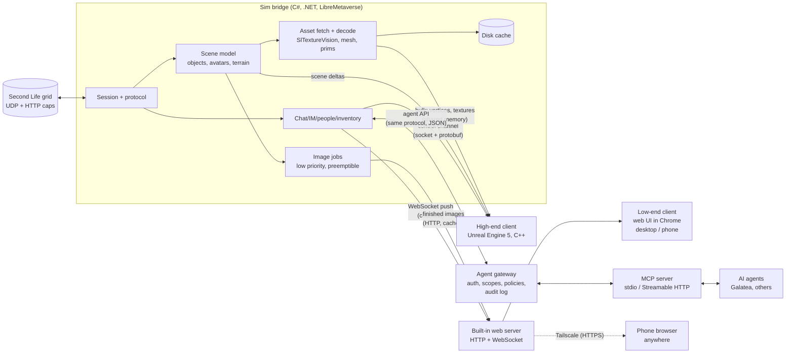

# Galatea viewer: design draft (Unreal high-end mode + chat-first low-end mode)

Status: **draft for David's review**, Oct 3, 2026. Nothing here is built yet. This doc does not change the live text client or the MCP connector. The system is meant for both people and AI agents: the same bridge serves a web UI, a high-end Unreal UI and a documented agent API (§6).

## Decisions log

Every decision David makes goes here, newest last, and the sections below are kept consistent with it.

| Date | Decision | Where it shows up |
|---|---|---|
| Oct 3, 2026 | **Low-end mode has no 3D at all.** It is a chat-first client; pictures are 2D only and made in the background at lower priority than chat. | §1, §4.1–4.3, §9 |
| Oct 3, 2026 | **The low-end client is web-based:** a local web UI served by the bridge, usable from any browser, including a phone. (Resolves open question 2.) | §2, §4.1, §5, §9 |
| Oct 3, 2026 | **The web client targets Chrome first:** desktop Chrome is primary. Chrome on Android/phones and other browsers (Edge, Firefox, Safari/iOS) come in a later milestone. | §4.1, §9 |
| Oct 3, 2026 | **Voice chat is needed at some point.** It goes in a later milestone, through SL's WebRTC voice. (Resolves open question 8.) | §1, §4.5, §9 (M11) |
| Oct 3, 2026 | **Galatea will eventually use this system for all her SL needs.** She migrates off today's text client onto the shared bridge, keeping every feature she relies on, with a rollback path. Until that cut-over, development never uses her account. (Resolves open question 7.) | §1, §6, §8, §9 (M6) |
| Oct 3, 2026 | **Design principle: open to any AI agent and first-class for humans.** The bridge has a stable, versioned, documented agent API (command/event protocol plus an MCP server), with per-agent auth and permissions. The web UI and the high-end UI are first-class clients of the same bridge, not afterthoughts. | §1, §2, §6, §9 (M0, M5) |
| Oct 3, 2026 | **Tailscale is fine for remote access.** It is the supported way in from outside the PC; no port is opened to the internet. (Resolves open question 9.) | §4.1, §4.6, §9 (M4) |
| Oct 3, 2026 | **Mobile, near term = a mobile website that works anywhere:** the same web client, responsive, reached from the phone over Tailscale from any network (not just the home LAN). **Later = dedicated apps in the iOS App Store and Google Play**, a future milestone. **How they're built is deliberately left open** (a wrapper around the web app, native apps, or a cross-platform toolkit; open question 15). The bridge API stays platform-neutral so any client type works. | §4.1, §4.6, §5, §9 (M4, M13) |
| Oct 3, 2026 | **David creates a separate SL test avatar himself for viewer development.** Its credentials are stored as a secret on the box, never in the repo, logs or docs. (Resolves open question 3.) | §8, §9, §10 |

## 1. Goals, non-goals, target hardware

**Goals**
- A Second Life viewer with two very different modes that share one connection core:
  - **Low-end mode: chat first, no 3D at all.** Local chat, IM, groups, people, inventory, teleports and offers are the product. They must stay instantly responsive on a weak laptop. Pictures (map tiles, profile pictures, textures, background-made "scene snapshots") are a nice extra, produced at lower priority and never allowed to slow chat down.
  - **High-end mode: full 3D in Unreal Engine 5**, aiming for visuals the official viewer can't reach (Lumen lighting, good post-processing, modern materials).
- Reuse what already works: the C# LibreMetaverse core behind Galatea's text client, and `SlTextureVision` for texture decoding.
- Stay inside Linden Lab's [Third-Party Viewer Policy](https://secondlife.com/corporate/third-party-viewers) from day one.
- **Open to any AI agent, and good for humans** (decided Oct 3). One bridge, one documented protocol: the web UI, the Unreal UI, Galatea and any other agent (via MCP or the raw protocol) are all clients of it, with per-client permissions (§6).
- **Galatea moves onto it** (decided Oct 3): the bridge eventually replaces today's text client for all her SL needs (M6).
- **Mobile anywhere:** the web client works on a phone from any network via Tailscale (M4). Store apps come later (M13).

**Non-goals for now**
- Build tools, mesh upload, the scripting editor, the marketplace, VR.
- Voice in the first milestones. It *is* wanted (see Decisions) but comes later (§4.5, M11).
- Supporting every SL feature in the high-end 3D mode. The fallback for anything missing is "use the official viewer or Firestorm for that."
- Mac/Linux high-end builds in the first year: we target Windows (David's PC) first.

**Hardware, honestly**
- UE5's documented development requirements are a quad-core 2.5 GHz CPU, 32 GB RAM and a DirectX 11/12 GPU with 8 GB+ VRAM. Lumen and Nanite need DirectX 12 with Shader Model 6 hardware: NVIDIA RTX 2000 series, AMD RX 6000 series, Intel Arc A-series or newer ([Epic: hardware and software specifications](https://dev.epicgames.com/documentation/en-us/unreal-engine/hardware-and-software-specifications-for-unreal-engine)). Those are requirements for the editor; a shipped game can run lower, but Lumen/Nanite set the floor for the high-end look.
- For comparison, the official SL viewer's minimum is a GPU with 4 GB VRAM and OpenGL 3.2, recommended 8 GB+ ([SL system requirements](https://secondlife.com/system-requirements)). So SL is already not a "weak computer" app in 3D.
- Epic's own Fortnite runs down to an Intel HD 4000 or Radeon Vega 8 with 8 GB RAM in its low-fidelity "Performance" mode ([Fortnite PC requirements](https://www.epicgames.com/help/en-US/c-Category_Fortnite/c-Fortnite_TechnicalSupport/what-are-the-system-requirements-for-fortnite-on-pc-a000084912)). But that is years of tuning by Epic on hand-authored content. SL content is user-made, unoptimized and streamed live, so we should not expect that.
- **So:**
  - **High-end** = RTX 2000 / RX 6000 class or better, 16 GB+ RAM. We will state that plainly.
  - **Low-end** = any machine that runs desktop Chrome comfortably, integrated graphics included, plus a phone browser (M4). That is only realistic *because* low-end mode does no 3D rendering (David's call, Oct 3). The bridge itself (a .NET process) runs on a PC; the browser can be on the same PC or another device.

## 2. Architecture

### 2.1 Overall shape

**One rule: the sim bridge owns the SL session.** Both front ends are views onto it. For low-end mode the bridge also contains a small web server that serves the web UI, so "installing low-end mode" means running the bridge and opening a page in Chrome. This is the text client's current shape, where the MCP connector and the CLI already talk to one process over a local socket, so we grow something that already works. Every client, human or agent, goes through the same command/event protocol and the same policy layer (§6), so a safety rule written once applies to everyone.

### 2.2 Why a C# sidecar instead of porting the protocol to C++

| Option | Pros | Cons |
|---|---|---|
| **A. C# bridge process (recommended)** | LibreMetaverse is BSD-3-Clause like galatea; it already handles login, caps, IMs, inventory, prims and sculpts (`PrimMesher`) and is proven daily by Galatea; a bridge crash doesn't take down the renderer and vice versa; low-end mode needs no Unreal at all. | Two processes, and an IPC layer to design; bulk data (meshes, textures) must cross a process boundary. |
| B. Port the protocol to C++ inside Unreal | One process, no IPC. | A large rewrite of mature code; we'd re-find years of protocol edge cases. |
| C. Reuse LL viewer C++ code (LGPL 2.1) | Authoritative protocol and rendering logic. | Unreal's EULA forbids combining the engine with LGPL code "unless you are merely dynamically linking a shared library" ([Unreal EULA, Non-Compatible Licenses](https://www.unrealengine.com/eula/unreal)). It's workable only as a separate DLL, the [viewer code](https://github.com/secondlife/viewer) is tightly coupled, and changes to it must be published under LGPL ([LL licensing](https://wiki.secondlife.com/wiki/Linden_Lab_Official:Second_Life_Viewer_Licensing_Program)). |
| D. C# inside Unreal via [UnrealSharp](https://github.com/UnrealSharp/UnrealSharp) | Same language as the core, in one process. | Young plugin that tracks recent UE versions; we'd tie session stability to it; and it doesn't help low-end mode. Worth a spike later, not as the foundation. |

### 2.3 IPC between bridge and front ends

- **Web client (low-end):** the browser loads static pages over HTTP from the bridge, then opens one **WebSocket**. The bridge pushes chat, IM, presence and offers over it the moment they arrive, and the page sends commands back (send IM, teleport, accept offer). Messages are small JSON objects (easy to debug in Chrome DevTools; binary can come later if ever needed). Images are plain HTTP URLs served from the bridge's cache, so Chrome's own image cache helps and an image never travels on the chat socket.
- **Control channel (high-end):** chat, IM, presence, commands and scene deltas (object added/moved/removed). These are small, frequent messages that must arrive in order. Use a local socket (Unix socket on Linux, named pipe on Windows) with length-prefixed **protobuf** messages.
  - **gRPC** is the polished version of this, with streaming and code generation. But it adds per-call RPC overhead and a heavy dependency for a same-machine link (see the discussion in [F. Werner, gRPC for local IPC](https://www.mpi-hd.mpg.de/personalhomes/fwerner/research/2021/09/grpc-for-ipc/)), and Unreal doesn't ship a gRPC client. Plain socket + protobuf is easy to call from C++ and C#. Both channels carry the same message types, defined once.
- **Bulk channel (high-end only):** decoded textures (RGBA mips) and mesh buffers go through **shared memory** (a ring of named memory-mapped regions). The control channel only carries a handle saying "texture X is ready at offset N". [FlatBuffers](https://github.com/google/flatbuffers) headers in the shared memory let Unreal read the data without parsing it.
- **Agent API (any AI agent):** the same JSON commands and events as the web client, over the same WebSocket or a local socket, plus an MCP server on top (§6). One schema, versioned, generates the docs and the protobuf/JSON bindings.
- **Priorities:** the control channel always has its own thread and is never blocked by asset traffic. Chat and IM messages sit at the head of the queue (see §4.3).

## 3. Content pipeline (high-end mode; partly reused by low-end images)

| Content | Source | Plan |
|---|---|---|
| **Prims** | Shape parameters in ObjectUpdate | Generate geometry in the bridge with LibreMetaverse `PrimMesher`; send vertex/index buffers to Unreal as runtime meshes (`DynamicMeshComponent`/`ProceduralMeshComponent`). Cache by shape hash. |
| **Sculpties** | Sculpt map texture | `PrimMesher` `SculptMesh` after decoding the map with SlTextureVision. |
| **Mesh** | Mesh asset: LLSD header + gzip'd LOD blocks, physics stored separately ([SL Mesh Asset Format](https://wiki.secondlife.com/wiki/Mesh/Mesh_Asset_Format)) | Decode in the bridge, keep all four LODs, pick the LOD in Unreal by screen size. |
| **Textures** | JPEG2000 | Decode in the bridge with SlTextureVision (already in galatea) and pass RGBA mips via shared memory → `UTexture2D` created at runtime. Textures can now be up to 2048×2048 ([SL release notes 7.1.7](https://releasenotes.secondlife.com/viewer/7.1.7.8883017948.html)), so stream by distance and screen size. |
| **Materials** | Legacy diffuse/normal/specular; glTF PBR since Nov 2023 ([SL PBR release](https://releasenotes.secondlife.com/viewer/7.0.1.6894459864.html)) | Two Unreal master materials: "legacy" and "glTF metallic-roughness". glTF maps onto UE's PBR model cleanly; legacy specular is approximated. |
| **Avatars** | Base avatar + Bento skeleton (106 extra bones: [Bento guide](https://wiki.secondlife.com/wiki/Project_Bento_Skeleton_Guide)), rigged mesh bodies and heads, alpha layers, [Bakes on Mesh](https://community.secondlife.com/knowledgebase/english/bakes-on-mesh-r1512/) | Build one Unreal skeleton matching SL's. Rigged mesh attachments become skeletal meshes bound to it. This is the hardest part: creating skeletal meshes at runtime is much less paved in Unreal than static meshes, so it gets its own milestone. Server-side bakes arrive as textures (easy); alpha masks need a custom material. |
| **Animations** | SL's own keyframe animation assets (uploaded as BVH or `.anim`) | Decode in the bridge and drive the skeleton with a runtime animation player (pose-by-pose at first, a proper anim graph later). |
| **Terrain** | Land patch packets (the text client already stores them for walking) + terrain textures / PBR terrain | Heightfield mesh per region; terrain material blends the 4 textures by height like SL. |
| **Water, sky** | Region/parcel environment ([EEP](https://wiki.secondlife.com/wiki/Environmental_Enhancement_Project)) | Map EEP sun/moon/haze/water settings onto UE Sky Atmosphere, Volumetric Clouds and a water plane. It will look different from SL, deliberately better. |
| **Streaming** | The sim's interest list sends objects nearest/most active first; cached objects arrive as `ObjectUpdateCached` + CRC ([ObjectUpdateCached](https://wiki.secondlife.com/wiki/ObjectUpdateCached)) | Bridge keeps a persistent object cache keyed by ID+CRC (like the official viewer), so revisits are fast. Unreal gets deltas, not snapshots. |
| **Cache** | Disk | Bridge-owned: decoded textures (by asset ID + discard level), meshes, prim geometry hashes. Shared by both modes. |

**Nanite reality check:** Nanite meshes are normally built offline when content is cooked. Stock UE5 has no supported path to turn runtime-created meshes into Nanite ([Nanite docs](https://dev.epicgames.com/documentation/en-us/unreal-engine/nanite-virtualized-geometry-in-unreal-engine); [Epic forum thread](https://forums.unrealengine.com/t/is-generation-of-nanite-meshes-during-runtime-possible/655107)). Third-party plugins claim runtime Nanite builds with real costs ([RealtimeMesh docs](https://triaxis.games/realtime-mesh/docs/rendering/nanite/)). Since all SL content arrives at runtime, **plan without Nanite**. Use classic LODs (SL mesh already has 4), and maybe try Nanite later for big static meshes we can build in the background and cache.

## 4. The two modes

### 4.1 Low-end mode: chat first, no 3D

**What it is:** a fast text client with a good-looking 2D interface. It's what Galatea's text client already does, plus a human-friendly UI and pictures that show up when they're ready.

**Decided (Oct 3): a local web UI served by the bridge, Chrome first.**
- No Unreal in low-end mode. Unreal (even with only Slate/UMG 2D) would bring a large install, a GPU-backed window, Unreal's startup time and the EULA, all to draw text boxes and images. The web client ships without any Epic code and stays BSD and royalty-free.
- The bridge serves plain HTML/CSS/JavaScript plus one WebSocket (§2.3). No build-heavy front-end framework is required at first; a small one can be added if the UI grows.
- **Desktop Chrome is the target and the test browser.** We develop and measure against it (Chrome DevTools for the latency checks). Responsive layout is designed in from the start so a phone works later, but the phone (the mobile website, §4.6) and other browsers are tested and fixed in their own milestone (M4).
- The page keeps working if the WebSocket drops: it reconnects and asks the bridge for everything missed since its last message ID, so a sleeping laptop or a phone switching networks doesn't lose chat.

**Access and security (implications of a web UI):**
- **Local-only by default.** The bridge listens on `127.0.0.1` only, so nothing else on the network can reach it.
- **Phone or another PC (decided Oct 3: Tailscale):** don't open a port to the internet. The supported route is [Tailscale Serve](https://tailscale.com/docs/features/tailscale-serve), which exposes a local service only to devices in your own tailnet over HTTPS with an automatically provisioned certificate. Because the phone runs the Tailscale app, this works from any network (home Wi-Fi, mobile data, a café), not just the home LAN. LAN-only access stays possible as an explicit opt-in. Not Tailscale *Funnel*, which would publish the page to the whole internet.
- **Login to the web UI:** even locally, the page needs a per-install secret (a token in the URL the bridge prints once, kept as a cookie), so another app or website in the same browser can't drive the session. The WebSocket checks the page's origin.
- **HTTPS matters for voice:** Chrome only allows the microphone in a secure context, meaning HTTPS or `localhost` ([MDN: getUserMedia](https://developer.mozilla.org/en-US/docs/Web/API/MediaDevices/getUserMedia); [MDN: secure contexts](https://developer.mozilla.org/en-US/docs/Web/Security/Defenses/Secure_Contexts)). Desktop on the same PC is fine over `http://localhost`; a phone needs HTTPS, which the Tailscale route provides (and which an installable home-screen web app needs too, §4.6).
- Agents get their own tokens with limited scopes, separate from the human UI's token (§6).
- The SL password is entered once at the bridge, never stored in the browser, and never sent anywhere except Linden Lab's login server.

**Responsiveness rules** (testable, see M1):
- Chat/IM input-to-send and receive-to-display under 100 ms on the bridge's side, whatever image work is running.
- Image work runs on a separate low-priority worker pool and is *preemptible*: it checks a cancel flag between steps and yields when chat traffic arrives.
- The UI never waits on an image. Placeholders appear first, and images replace them when ready.
- In the browser: chat arrives over the WebSocket and is drawn immediately. Images load lazily (only when visible), and the page never blocks rendering on them.

### 4.2 Where the 2D pictures come from

Ordered from cheapest to most ambitious:

1. **Map tiles:** the official Map API serves region images from `map.secondlife.com/map-{z}-{x}-{y}-objects.jpg` ([Map API intro](https://wiki.secondlife.com/wiki/Linden_Lab_Official:Map_API_Introduction)). Free, accurate for layout, and official. Overlay avatar dots from the bridge's positions. **Do first.**
2. **Profile pictures, place pictures, textures:** fetched like any viewer does and decoded with SlTextureVision. They show who you're talking to and what something looks like (e.g. a vendor board). Cheap and accurate. **Do first.**
3. **Composited 2D scene image:** the bridge already knows nearby objects, avatars, their positions and textures. It can lay out a top-down or "isometric card" view: the map tile as the floor, object footprints tinted by their main texture, avatars as profile pictures at their positions. Cheap and runs fully locally. It isn't a photo, but it's honest about what's there. **Do second.**
4. **Software-rendered snapshot on the user's own machine:** rasterize a low-resolution 3D view on the CPU, with no GPU needed, in the background every N seconds while idle (e.g. using our prim/mesh geometry and textures). Medium effort, accurate, slow on weak CPUs but preemptible. A good "later" option.
5. **Render by a high-end instance ("cloud/remote render"):** a strong machine renders real 3D views and sends images. Tradeoffs:
   - A remote renderer needs its *own SL session*. SL allows one login per account, so either the user's own session moves there (then it's really game streaming), or it's a separate bot account, which follows SL's bot rules ([TPV policy §4.a.iii](https://secondlife.com/corporate/third-party-viewers)) and only sees what's near *it*.
   - Sending other residents' content to a server is not "export" under §2.b, but it is user data. It needs a published privacy policy (§4.b) and care around privacy options (§2.a.iii).
   - It also costs GPU servers. **Not recommended** except as an opt-in for David's own setup (e.g. his PC renders for his laptop at home).
6. **AI-generated illustration from a scene description** ("a campfire at dusk, two avatars sitting, pine trees"):
   - Pretty, but *invented*: it will show things that aren't there and get people's looks wrong, which matters socially in SL.
   - It costs money per image if hosted, and it sends descriptions of people and places to a third party, which again needs privacy-policy disclosure.
   - Fine as an optional "mood picture" clearly labeled as illustration. Never present it as what's actually there.

**Recommendation:** ship 1+2+3. Consider 4 next. Keep 5 and 6 opt-in experiments, clearly labeled.

### 4.3 Priority scheduler (shared by both modes)

- **P0, never queued behind anything:** incoming/outgoing chat and IM, teleport/friendship/group offers, presence, region-restart warnings.
- **P1:** UI state (people list, inventory listing, map position).
- **P2:** visible-now assets (the profile picture of the person you're talking to, the map tile you're on).
- **P3:** background (composited scene images, prefetch, cache cleanup).

How it's built:
- A separate thread for P0 with its own socket queue.
- A bounded worker pool for P2/P3 that pauses whenever P0 traffic arrives within the last ~2 s.
- Download bandwidth for P3 is throttled so a big texture never fills the connection during a conversation.

### 4.4 High-end mode: full 3D in Unreal

- Deferred renderer with **Lumen** global illumination and reflections, Virtual Shadow Maps, Sky Atmosphere and volumetric clouds for EEP skies, TSR upscaling for frame rate.
- Content uses classic LODs (no Nanite, §3). Distant objects can fall back to cached **impostors**: billboards rendered once from the object.
- A scalability menu (Unreal's built-in quality presets) lets mid-range cards (e.g. GTX 10-series) run without Lumen. But below RTX/RX 6000 class, we tell users to choose low-end mode.

### 4.5 Voice (decided Oct 3: needed, later milestone)

- **What SL uses:** SL historically used Vivox and is replacing it with its own WebRTC voice service ([SL wiki: WebRTC Voice](https://wiki.secondlife.com/wiki/WebRTC_Voice)). The full grid-wide WebRTC deployment was announced for May 5, 2026, and viewers that rely only on Vivox lose voice once Vivox is switched off ([Inara Pey, May 4, 2026](https://modemworld.me/2026/05/04/be-ready-webrtc-goes-grid-wide-in-second-life-may-5th-2026/)). **So we build WebRTC voice only, no Vivox.** We should confirm the switch-over really completed before M11.
- **Why it fits the web client:** WebRTC is built into Chrome (microphone access, echo cancellation, audio codecs). Being built into most browsers is part of why LL picked it (same Inara Pey post).
- **Two ways to wire it**, to be decided by a spike:
  - **(A) Browser does the audio:** the bridge only does the SL side: asking the region for a voice session and passing the WebRTC offer/answer between Chrome and SL's voice server. Chrome then talks to the voice server directly. Nicest audio and lowest bridge load. Unverified risks: whether SL's voice servers accept a browser as a peer as-is, and how the bridge must relay connection details.
  - **(B) Bridge does the audio:** LibreMetaverse already contains a C# WebRTC voice client (`LibreMetaverse.Voice.WebRTC`, built on SIPSorcery, in our vendored copy). The bridge joins voice itself and streams audio to and from the page. More moving parts and latency, but it doesn't depend on (A)'s unknowns, and the high-end Unreal client could reuse it.
  - Plan: try (A) first in M11; fall back to (B).
- **Constraints:**
  - Microphone needs HTTPS or localhost in Chrome (§4.1).
  - Push-to-talk by default, and the mic is off until the user turns it on.
  - Spatial voice (louder when closer) is done by SL's voice service, which got an HRTF spatialization update during the rollout ([Inara Pey, Nov 25, 2025](https://modemworld.me/2025/11/25/)); we should not reimplement it.
  - Voice is P0 traffic in the scheduler (§4.3), right next to chat.
  - Galatea never joins voice unless David explicitly asks.

### 4.6 Mobile (decided Oct 3: mobile website first, store apps later)

- **Near term: a mobile website.** It is the same web client the bridge serves, with a responsive phone layout. No separate code base.
- **Works anywhere:** the phone reaches the bridge over Tailscale (decided Oct 3) from any network. The bridge keeps running on an always-on machine (David's PC or the box), and the phone is just a browser tab, so closing it doesn't log the avatar out. When the tab reopens, it catches up from the last message ID (§4.1).
- **Add to home screen:** with a web app manifest, served over HTTPS (which Tailscale Serve provides), Chrome can install the site like an app ([MDN: making PWAs installable](https://developer.mozilla.org/en-US/docs/Web/Progressive_web_apps/Guides/Making_PWAs_installable)). That's cheap, so it's in M4.
- **Notifications while the phone is locked** are the main weak spot of a website:
  - Web Push needs a service worker ([MDN: Push API](https://developer.mozilla.org/en-US/docs/Web/API/Push_API)). It works in Chrome on Android.
  - On iOS, web push works only for web apps added to the home screen, on iOS 16.4 or later ([OneSignal: web push for iOS](https://documentation.onesignal.com/docs/en/web-push-for-ios)).
  - Push messages travel through the browser vendor's push service, i.e. Google's or Apple's ([MDN: offline and background operation](https://developer.mozilla.org/en-US/docs/Web/Progressive_web_apps/Guides/Offline_and_background_operation)). Send only "new IM" with no message text, and let the page fetch the content over Tailscale.
  - The bridge would need to reach the push service from the PC. That's fine (outbound only), but it's an extra moving part, so push is optional in M4 and properly done in M13.
- **Later: dedicated store apps (iOS App Store, Google Play), M13.** **Not decided whether they reuse the web app** (open question 15). The options are: a wrapper around the web app (e.g. [Capacitor](https://capacitorjs.com/docs) or PWA store packaging); fully native apps (Swift/Kotlin); or a cross-platform toolkit ([React Native](https://reactnative.dev/), [Flutter](https://flutter.dev/), [.NET MAUI](https://learn.microsoft.com/dotnet/maui/)). Any store app gives more reliable notifications and background behaviour, a normal app icon and store discovery. The cost is store accounts and review, and listing it publicly counts as distributing a viewer, so the TPV obligations (privacy policy, disclosures, §7) apply first. It also has to answer "how does the app reach the bridge" for users without Tailscale (see the relay tradeoff below).
- **Tailscale vs. a relay (tradeoff):**
  - **Tailscale (chosen):** no server for us to run, end-to-end encrypted, no port opened, free for personal use. The downside: every phone needs the Tailscale app and has to join the tailnet, which is fine for David and awkward for strangers.
  - **Our own hosted relay** (bridge and phone both connect out to a server we run): no extra app on the phone, so it's friendlier for a public store app. The downsides: it costs money, it's a security target that sees everyone's session traffic unless we add end-to-end encryption, and it brings privacy-policy and data-handling duties under the TPV policy. **Not planned**; it's only revisited if the store apps (M13) need it.

## 5. UI

- **Both modes:**
  - Local chat with distances and names
  - IM tabs (shows our duplicate-send guard state)
  - Group chat
  - People nearby and friends
  - Inventory (browse, wear/detach, give)
  - World map with search and teleport
  - Offers inbox (friendship, inventory, group invites; the same rules as today)
  - Notifications
  - Profiles
- **Low-end (web, Chrome first):**
  - Chat is the center of the screen.
  - Responsive layout: on a wide screen, chat + side panels; on a phone (the mobile website, §4.6), chat full-screen with panels as tabs.
  - Chrome desktop notifications (with permission) for IMs and offers when the tab is in the background.
  - A side panel shows the current "scene card" (map tile + composited image) and the person you're talking to.
  - Keyboard first on desktop, large touch targets on phones.
- **High-end:** Unreal UMG panels over the 3D view, with the same panels as low-end so habits transfer. (A later option: show the web UI inside Unreal's built-in web browser widget so we build the panels once.)
- **HUDs:** in 3D, render HUD attachments as screen-space prims. In low-end, show a list of the HUD's buttons (prim names), backed by what `worn links` / `touch-attachment` already do.
- **Build tools:** deferred (non-goal for now).
- **Agents are visible to humans:** a panel lists the connected agents, what scopes they have and what they did recently (from the audit log, §6). A human can pause or revoke an agent from there. Messages an agent sends are marked as agent-sent in the local history.

## 6. Agent API: any AI agent and humans on one bridge (decided Oct 3)

**Principle:** the bridge is a general-purpose SL session server. Humans (web UI, Unreal UI, phone) and AI agents (Galatea, or any other agent via MCP or the raw protocol) are all clients of the same bridge, see the same event stream and go through the same rules. The web UI uses only the public protocol, with no private back door, so the API stays complete and tested.

### 6.1 The protocol

- **Commands and events, versioned.** Commands are things like `chat.say`, `im.send`, `move.teleport`, `offer.accept` and `inventory.wear`. Events are things like `chat.received`, `im.received`, `presence.changed` and `offer.received`. Each event has a monotonically increasing ID so any client can reconnect and ask for what it missed.
- **One schema, written once** (JSON Schema or protobuf), from which the docs, the JSON over WebSocket and the protobuf for Unreal are all generated. A client states the protocol version it speaks; changes within a major version are additive only, and breaking changes bump the major version with a deprecation period.
- **Transports:** the WebSocket (same as the web UI) and a local socket. Replies are structured: ok, error with a code, or `skipped` with a reason (as today's IM guard does).
- **Platform-neutral:** plain JSON over WebSocket/HTTP (plus protobuf for Unreal) with no browser-only or .NET-only assumptions, so a web page, an Unreal client, a native iOS/Android app, a cross-platform app (React Native, Flutter, .NET MAUI) or an AI agent can all be clients. Auth uses bearer tokens, not cookies alone, so non-browser clients work too.
- **Documented publicly** in the repo, with examples and a small reference client, so an agent author can start without reading bridge code.

### 6.2 MCP server interface

- The bridge ships an MCP server that exposes the protocol as MCP tools (send IM, read recent chat, nearby, teleport, accept offer, ...) and resources (chat history, people nearby), like today's text-client connector but generic.
- **Transports** per the MCP spec: **stdio** for an agent on the same machine and **Streamable HTTP** for remote agents ([MCP: transports](https://modelcontextprotocol.io/specification/2025-03-26/basic/transports)). For HTTP the spec requires validating the `Origin` header, recommends binding to localhost when running locally, and calls for proper authentication. Remote agents come in over Tailscale, like the phone.
- **Auth for HTTP** follows the [MCP authorization spec](https://modelcontextprotocol.io/specification/2026-07-28/basic/authorization): OAuth 2.1-style bearer tokens on every request, and HTTP 401 for a missing or invalid token. For a single-user install, a token issued by the bridge's UI is enough at first; a full OAuth flow comes if third parties use it.

### 6.3 Per-agent auth, permissions and policies

- **Each client gets its own token** with a name and a set of scopes, and a human approves it in the UI. Revoking a token cuts that client off immediately.
- **Scopes (draft):** `chat.read`, `im.read`, `chat.send`, `im.send`, `move` (walk, sit, follow), `teleport`, `inventory.read`, `inventory.wear`, `offers.accept`, `profile.edit`. **`money` (paying or accepting L$ charges) is never granted by default** and needs a separate, explicit human approval, mirroring today's L$ rule.
- **Bridge-level policies apply to every client, human UIs included where it makes sense:** today's per-recipient IM duplicate guard and heads-up rule, rate limits per client, the money rule, the offers policy (e.g. the Sunrise Suites L$0 auto-accept rule) and the webhook daily cap. They move from the text client into the bridge, so a new agent gets them for free.
- **Audit log:** every command records who sent it (which human UI or agent), when, and the result. The UI shows it (§5).
- **Humans and agents together:** several clients can be connected at once. Every command is attributed. A human can switch an agent to "read-only" or "paused" while they drive. Agents don't log in or out without the right scope.

### 6.4 Second Life's rules for AI-driven accounts

- Linden Lab's [Scripted Agent Policy](https://wiki.secondlife.com/wiki/Linden_Lab_Official:Scripted_Agent_Policy) requires accounts that are primarily operated by software to be marked as scripted agents in their account settings. The bridge's docs must say this plainly for anyone connecting an agent.
- Estates can refuse scripted agents (the `deny_bots` access setting; [LL: scripted agent estate access FAQ](https://lindenlab.freshdesk.com/support/solutions/articles/31000169561-scripted-agent-estate-access-faq)). The bridge should report such a refusal clearly to the agent instead of retrying.
- The TPV policy still applies to the bridge as a viewer, whoever drives it (§7).

## 7. Licensing

- **galatea:** BSD-3-Clause (LICENSE at the repo root). The bridge and low-end UI stay BSD and contain no Epic code.
- **LibreMetaverse:** BSD-3-Clause, compatible both ways.
- **Unreal Engine:**
  - Royalty: 5% of gross revenue above the first $1M per product ([Unreal license](https://www.unrealengine.com/license); [EULA](https://www.unrealengine.com/eula/unreal)). Below that it's free.
  - Engine source can only be shared with other Unreal licensees (e.g. via a fork of Epic's GitHub network), not published openly. The products shipped to users may only contain engine object code, not Engine Tools ([EULA summary](https://unrealcontainers.com/docs/obtaining-images/eula-restrictions)).
  - Practical consequence: our high-end client's *own* C++ code and Unreal project can be public BSD. Anyone building it needs their own free Epic account to get the engine.
- **LGPL (LL viewer code):** Unreal's EULA bans combining the engine with LGPL code except plain dynamic linking of a shared library ([EULA §Non-Compatible Licenses](https://www.unrealengine.com/eula/unreal)). Under LL's own policy, any LL viewer code we use must have its source published ([TPV policy §3.b.iii](https://secondlife.com/corporate/third-party-viewers)). **Recommendation: borrow no LL viewer code.** Read it as protocol documentation only, which the TPV policy itself points to for the protocol.
- **Third-Party Viewer Policy:** the parts that apply to us ([policy](https://secondlife.com/corporate/third-party-viewers)):
  - a unique viewer identifier per version, never spoofed (§1.b, §2.c.ii)
  - pre-install disclosures, including "This software is not provided or supported by Linden Lab, the makers of Second Life" (§1.c)
  - user acceptance of the Terms of Service (§1.f)
  - version shown on the login screen and in "About" (§1.g)
  - easy uninstall (§1.e)
  - no export of others' content (§2.b)
  - a privacy policy if we distribute it (§4.b)
  - a name that can't contain "Second", "Life", "SL" or "Linden" (§5.b)
  - Listing in the [viewer directory](https://wiki.secondlife.com/wiki/Third_Party_Viewer_Directory) is optional but recommended once public.

## 8. Galatea stays unaffected (until the planned cut-over)

- **Separate everything:** new code under a new folder (e.g. `viewer/`) on its own branches. The bridge is a *new* process built from the shared core; it never touches the live text client's run directory, socket, app folder or deploy scripts.
- **Never Galatea's account for development, until the planned cut-over (M6).** SL allows one session per account, so logging in the viewer as Galatea would kick her live session. Use the separate test avatar David is creating himself (decided Oct 3), on the Aditi beta grid where possible. Its credentials live only as a secret on the box (outside the repo, never committed, logged or printed); the bridge reads them at login.
- **Builds and GPU testing on David's Windows PC.** The box has no GPU. The box can build and test the bridge and the web UI (including headless Chrome tests), but Unreal builds, shader compiles and any 3D testing happen on David's PC.
- **Agent rules:** no deploy or restart of the live client or MCP connector as part of viewer work. Viewer PRs never modify `textclient/`; shared code is copied or factored out only in a separate, explicitly approved PR.
- **The cut-over itself (M6)** is the one planned exception: an explicitly approved, scheduled switch with the old text client kept ready to roll back.

## 9. Milestones (each ends in a demo)

- **M0: bridge spike + protocol v0.** A new bridge process logs the *test avatar* in (credentials from the box secret) and exposes the control channel. The command/event schema (§6.1) is written down from day one, and a throwaway CLI uses only that schema to show chat/IM flowing.
  *Exit: send and receive IM/chat through the bridge; Galatea's live session untouched.*
- **M1: low-end web prototype (chat first, desktop Chrome).** The bridge serves the web UI on `127.0.0.1` with a per-install token. Local chat, IM tabs, people nearby, offers inbox over the WebSocket push, reconnect-and-catch-up, and the P0/P3 scheduler. The web UI uses only the public protocol.
  *Exit: a 30-minute live chat in desktop Chrome on a weak laptop, with the P3 load generator saturating image work, shows chat latency under 100 ms throughout, bridge-side and receive-to-screen (measured and logged).*
- **M2: low-end pictures.** Map tiles + avatar dots, profile pictures, texture previews via SlTextureVision (served over HTTP from the cache), then the composited scene card.
  *Exit: in desktop Chrome, walking into a busy region shows a scene card within ~30 s without any chat slowdown (same latency log).*
- **M3: low-end daily-driver (desktop Chrome).** Inventory (wear/detach), teleport by map/landmark, group chat, profiles, HUD button lists, desktop notifications.
  *Exit: David spends an evening in SL using only low-end mode in desktop Chrome.*
- **M4: mobile website, works anywhere + other browsers.** Phone layout polished. Remote access through Tailscale Serve (HTTPS, tailnet only) from any network. Web app manifest so it can be added to the home screen; optional Web Push with no message text (§4.6). Testing and fixes on Chrome for Android, then Edge, Firefox and Safari on iOS.
  *Exit: David chats for 30 minutes from his phone on mobile data (away from home) over Tailscale, with no port open to the internet; a checklist of the core flows passes in each listed browser.*
- **M5: agent API v1 + MCP server.** Protocol v1 frozen and documented with a reference client; MCP server over stdio and Streamable HTTP (Origin check, bearer tokens, 401); per-agent tokens and scopes; the IM duplicate guard, heads-up rule, rate limits, money rule, offers policy and webhook cap moved into the bridge as policies for all clients; audit log and the agents panel in the web UI.
  *Exit: on the test account, a generic MCP client (not our code) and the web UI are connected at the same time; the agent can chat but is refused `teleport` and `money` without those scopes; every action shows up in the audit log.*
- **M6: Galatea migration.** Galatea moves from the text client onto the bridge. Before the switch: feature parity checked against a list of everything she uses today (webhook wake-ups and cap, IM guard and heads-up, persisted offers and auto-accept rules, autofollow, wander, sit/stand, worn/touch-attachment, texture vision, inventory, group invites, logs), with her agent connected through the M5 API. Then a scheduled cut-over approved by David, with the old text client kept installed and runnable for rollback, and a 1-week parallel watch period.
  *Exit: Galatea runs a full week on the bridge with no lost IMs/offers and no duplicate sends; rollback tested once in a dry run; the text client is retired only after David signs off.*
- **M7: high-end spike.** Unreal project on David's PC connected to the bridge via the control + shared-memory channels. It renders region terrain and plain prims (PrimMesher geometry, flat colors) with free-fly camera.
  *Exit: a recognizable region layout in Unreal, live, with objects appearing as they stream in.*
- **M8: textures, mesh, materials.** SlTextureVision textures through shared memory, mesh LODs, legacy + glTF PBR materials, EEP sky/water.
  *Exit: side-by-side screenshots with Firestorm of the same spot look clearly "the same place".*
- **M9: avatars.** SL skeleton in Unreal, rigged mesh bodies/heads, bakes on mesh, alpha masks, animation playback, our own avatar walking.
  *Exit: Galatea's look (on the test account, with a copy of the outfit) renders correctly, standing, walking and sitting.*
- **M10: high-end UI + polish.** Shared panels from low-end in UMG, Lumen on, scalability presets, impostors, cache.
  *Exit: a 1-hour session in a busy region on an RTX-class PC at a stable frame rate, without crashes.*
- **M11: voice (WebRTC).** Spike approach (A), browser audio via the bridge's signaling, and fall back to (B), the bridge's LibreMetaverse WebRTC client, if needed. Push-to-talk in the web client (desktop Chrome first, then the mobile website); later in the Unreal client.
  *Exit: David holds a 10-minute voice conversation with another avatar (local/spatial voice and one IM call) from desktop Chrome, while text chat stays under the M1 latency bar.*
- **M12: public-readiness.** TPV policy checklist, disclosures, privacy policy, unique viewer ID, installer/uninstaller, name chosen, public agent-API docs including the Scripted Agent Policy note (§6.4).
  *Exit: ready to apply for the TPV directory.*
- **M13 (future): store apps for iOS and Android.** Apps for the iOS App Store and Google Play with reliable notifications. The technology is chosen at the start of the milestone (open question 15); every option talks to the bridge through the same public API (§6.1). It needs M12 first (privacy policy, name) and a decision on how users without Tailscale reach their bridge (§4.6).
  *Exit: the app passes App Store and Google Play review, and David uses it for a week in place of the mobile website.*

Low-end comes first because it is cheap and useful right away, and it builds the bridge the 3D mode needs anyway. The agent API (M5) and Galatea's migration (M6) come before 3D because they only need the bridge, and they turn Galatea into the bridge's heaviest daily tester. Voice (M11) only depends on M1–M3, and the store apps (M13) only on M4 and M12, so either can move earlier if David wants.

## 10. Open questions for David

1. **Image generation approach for low-end mode:** are map tiles + profile pictures + composited scene cards (local, accurate, free) enough at first? Do you also want an opt-in software snapshot, a remote render from your PC, or AI-made "mood pictures" clearly labeled as illustrations?
2. ~~Low-end UI technology: web or native?~~ **Resolved Oct 3, 2026: web-based (local web UI served by the bridge), desktop Chrome first.** See Decisions.
3. ~~Test account for viewer development?~~ **Resolved Oct 3, 2026: David creates a separate test avatar himself; its credentials are stored as a secret on the box, never in the repo.** See Decisions.
4. Is Windows-only acceptable for high-end mode in year one? Which GPU is in your PC?
5. Product intent: open-source hobby viewer, or a product you may sell (affects the name, TPV directory listing and the Unreal royalty planning above $1M)?
6. Viewer name: the TPV policy forbids "Second", "Life", "SL" or "Linden" in it. Any ideas?
7. ~~Should Galatea herself eventually use the bridge?~~ **Resolved Oct 3, 2026: yes, for all her SL needs; migration milestone M6.** See Decisions.
8. ~~Voice: needed at some point, or permanently out of scope?~~ **Resolved Oct 3, 2026: needed, as a later milestone (M11), via SL's WebRTC voice.** See Decisions.
9. ~~Remote access for the phone: Tailscale or LAN-only?~~ **Resolved Oct 3, 2026: Tailscale is fine** (§4.1, §4.6). See Decisions.
10. **Agent access:** which agents besides Galatea should get access at first, and is the draft default scope set (§6.3: read + chat/IM, no teleport/inventory changes, never `money`) right?
11. **Scripted agent flag:** once Galatea runs on the bridge, should her account be marked as a scripted agent under LL's Scripted Agent Policy (§6.4)? It's arguably required if she's primarily AI-operated, but it means estates with `deny_bots` will refuse her.
12. **Migration timing:** do the cut-over (M6) as soon as M5 is done, or wait until the bridge has proven itself for a while with your own use first?
13. **Where the always-on bridge runs** for mobile-anywhere: your PC (must stay awake) or the box, and is it one bridge per SL account (yours and Galatea's separately)?
14. **Store apps (M13):** Tailscale-only (simple, but every user installs Tailscale) or eventually a hosted relay (friendlier, but cost, security and privacy duties; §4.6)?
15. **Store apps (M13): how to build them?** Left open on purpose:
    - **Wrapper around the web app** (e.g. Capacitor, PWA packaging): one UI code base and the fastest route; but it feels less native, and Apple may reject apps that are little more than a website.
    - **Native apps (Swift for iOS, Kotlin for Android):** the best feel, notifications and background behaviour, and voice/audio integration; but two more code bases to build and maintain.
    - **Cross-platform toolkit** (React Native, Flutter, .NET MAUI): one mobile code base with near-native UI. .NET MAUI can share C# with the bridge, and React Native can share skills and some code with the web UI. It's still a second UI code base next to the web client.
    - All three talk to the same platform-neutral bridge API (§6.1), so this can be decided late.
