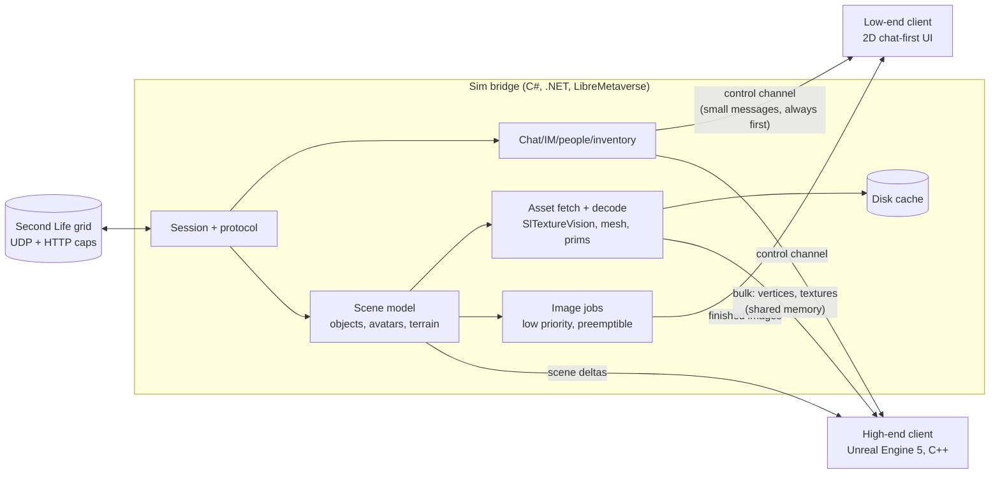

# Galatea viewer: design draft (Unreal high-end mode + chat-first low-end mode)

Status: **draft for David's review**, Oct 3, 2026. Nothing here is built yet. This doc does not change the live text client or the MCP connector.

## 1. Goals, non-goals, target hardware

**Goals**
- A Second Life viewer with two very different modes that share one connection core:
  - **Low-end mode: chat first, no 3D at all.** Local chat, IM, groups, people, inventory, teleports and offers are the product. They must stay instantly responsive on a weak laptop. Pictures (map tiles, profile pictures, textures, background-made "scene snapshots") are a nice extra, produced at lower priority and never allowed to slow chat down.
  - **High-end mode: full 3D in Unreal Engine 5**, aiming for visuals the official viewer can't reach (Lumen lighting, good post-processing, modern materials).
- Reuse what already works: the C# LibreMetaverse core behind Galatea's text client, and `SlTextureVision` for texture decoding.
- Stay inside Linden Lab's [Third-Party Viewer Policy](https://secondlife.com/corporate/third-party-viewers) from day one.

**Non-goals for now**
- Build tools, mesh upload, the scripting editor, voice, the marketplace, VR.
- Supporting every SL feature in the high-end 3D mode. The fallback for anything missing is "use the official viewer or Firestorm for that."
- Mac/Linux high-end builds in the first year: we target Windows (David's PC) first.

**Hardware, honestly**
- UE5's documented development requirements are a quad-core 2.5 GHz CPU, 32 GB RAM and a DirectX 11/12 GPU with 8 GB+ VRAM. Lumen and Nanite need DirectX 12 with Shader Model 6 hardware: NVIDIA RTX 2000 series, AMD RX 6000 series, Intel Arc A-series or newer ([Epic: hardware and software specifications](https://dev.epicgames.com/documentation/en-us/unreal-engine/hardware-and-software-specifications-for-unreal-engine)). Those are requirements for the editor; a shipped game can run lower, but Lumen/Nanite set the floor for the high-end look.
- For comparison, the official SL viewer's minimum is a GPU with 4 GB VRAM and OpenGL 3.2, recommended 8 GB+ ([SL system requirements](https://secondlife.com/system-requirements)). So SL is already not a "weak computer" app in 3D.
- Epic's own Fortnite runs down to an Intel HD 4000 or Radeon Vega 8 with 8 GB RAM in its low-fidelity "Performance" mode ([Fortnite PC requirements](https://www.epicgames.com/help/en-US/c-Category_Fortnite/c-Fortnite_TechnicalSupport/what-are-the-system-requirements-for-fortnite-on-pc-a000084912)). But that is years of tuning by Epic on hand-authored content. SL content is user-made, unoptimized and streamed live, so we should not expect that.
- **So:**
  - **High-end** = RTX 2000 / RX 6000 class or better, 16 GB+ RAM. We will state that plainly.
  - **Low-end** = any laptop that can run a browser comfortably, integrated graphics included. That is only realistic *because* low-end mode does no 3D rendering (David's call, Oct 3).

## 2. Architecture

### 2.1 Overall shape

**One rule: the sim bridge owns the SL session.** Both front ends are views onto it. This is the text client's current shape, where the MCP connector and the CLI already talk to one process over a local socket, so we grow something that already works.

### 2.2 Why a C# sidecar instead of porting the protocol to C++

| Option | Pros | Cons |
|---|---|---|
| **A. C# bridge process (recommended)** | LibreMetaverse is BSD-3-Clause like galatea; it already handles login, caps, IMs, inventory, prims and sculpts (`PrimMesher`) and is proven daily by Galatea; a bridge crash doesn't take down the renderer and vice versa; low-end mode needs no Unreal at all. | Two processes, and an IPC layer to design; bulk data (meshes, textures) must cross a process boundary. |
| B. Port the protocol to C++ inside Unreal | One process, no IPC. | A large rewrite of mature code; we'd re-find years of protocol edge cases. |
| C. Reuse LL viewer C++ code (LGPL 2.1) | Authoritative protocol and rendering logic. | Unreal's EULA forbids combining the engine with LGPL code "unless you are merely dynamically linking a shared library" ([Unreal EULA, Non-Compatible Licenses](https://www.unrealengine.com/eula/unreal)). It's workable only as a separate DLL, the [viewer code](https://github.com/secondlife/viewer) is tightly coupled, and changes to it must be published under LGPL ([LL licensing](https://wiki.secondlife.com/wiki/Linden_Lab_Official:Second_Life_Viewer_Licensing_Program)). |
| D. C# inside Unreal via [UnrealSharp](https://github.com/UnrealSharp/UnrealSharp) | Same language as the core, in one process. | Young plugin that tracks recent UE versions; we'd tie session stability to it; and it doesn't help low-end mode. Worth a spike later, not as the foundation. |

### 2.3 IPC between bridge and front ends

- **Control channel:** chat, IM, presence, commands and scene deltas (object added/moved/removed). These are small, frequent messages that must arrive in order. Use a local socket (Unix socket on Linux, named pipe on Windows) with length-prefixed **protobuf** messages.
  - **gRPC** is the polished version of this, with streaming and code generation. But it adds per-call RPC overhead and a heavy dependency for a same-machine link (see the discussion in [F. Werner, gRPC for local IPC](https://www.mpi-hd.mpg.de/personalhomes/fwerner/research/2021/09/grpc-for-ipc/)), and Unreal doesn't ship a gRPC client. Plain socket + protobuf keeps the low-end client tiny and is easy to call from C++ and C#.
- **Bulk channel (high-end only):** decoded textures (RGBA mips) and mesh buffers go through **shared memory** (a ring of named memory-mapped regions). The control channel only carries a handle saying "texture X is ready at offset N". [FlatBuffers](https://github.com/google/flatbuffers) headers in the shared memory let Unreal read the data without parsing it.
- **Priorities:** the control channel always has its own thread and is never blocked by asset traffic. Chat and IM messages sit at the head of the queue (see §4.3).

## 3. Content pipeline (high-end mode; partly reused by low-end images)

| Content | Source | Plan |
|---|---|---|
| **Prims** | Shape parameters in ObjectUpdate | Generate geometry in the bridge with LibreMetaverse `PrimMesher`; send vertex/index buffers to Unreal as runtime meshes (`DynamicMeshComponent`/`ProceduralMeshComponent`). Cache by shape hash. |
| **Sculpties** | Sculpt map texture | `PrimMesher` `SculptMesh` after decoding the map with SlTextureVision. |
| **Mesh** | Mesh asset: LLSD header + gzip'd LOD blocks, physics stored separately ([SL Mesh Asset Format](https://wiki.secondlife.com/wiki/Mesh/Mesh_Asset_Format)) | Decode in the bridge, keep all four LODs, pick the LOD in Unreal by screen size. |
| **Textures** | JPEG2000 | Decode in the bridge with SlTextureVision (already in galatea) and pass RGBA mips via shared memory → `UTexture2D` created at runtime. Textures can now be up to 2048×2048 ([SL release notes 7.1.7](https://releasenotes.secondlife.com/viewer/7.1.7.8883017948.html)), so stream by distance and screen size. |
| **Materials** | Legacy diffuse/normal/specular; glTF PBR since Nov 2023 ([SL PBR release](https://releasenotes.secondlife.com/viewer/7.0.1.6894459864.html)) | Two Unreal master materials: "legacy" and "glTF metallic-roughness". glTF maps onto UE's PBR model cleanly; legacy specular is approximated. |
| **Avatars** | Base avatar + Bento skeleton (106 extra bones: [Bento guide](https://wiki.secondlife.com/wiki/Project_Bento_Skeleton_Guide)), rigged mesh bodies and heads, alpha layers, [Bakes on Mesh](https://community.secondlife.com/knowledgebase/english/bakes-on-mesh-r1512/) | Build one Unreal skeleton matching SL's. Rigged mesh attachments become skeletal meshes bound to it. This is the hardest part: creating skeletal meshes at runtime is much less paved in Unreal than static meshes, so it gets its own milestone. Server-side bakes arrive as textures (easy); alpha masks need a custom material. |
| **Animations** | SL's own keyframe animation assets (uploaded as BVH or `.anim`) | Decode in the bridge and drive the skeleton with a runtime animation player (pose-by-pose at first, a proper anim graph later). |
| **Terrain** | Land patch packets (the text client already stores them for walking) + terrain textures / PBR terrain | Heightfield mesh per region; terrain material blends the 4 textures by height like SL. |
| **Water, sky** | Region/parcel environment ([EEP](https://wiki.secondlife.com/wiki/Environmental_Enhancement_Project)) | Map EEP sun/moon/haze/water settings onto UE Sky Atmosphere, Volumetric Clouds and a water plane. It will look different from SL, deliberately better. |
| **Streaming** | The sim's interest list sends objects nearest/most active first; cached objects arrive as `ObjectUpdateCached` + CRC ([ObjectUpdateCached](https://wiki.secondlife.com/wiki/ObjectUpdateCached)) | Bridge keeps a persistent object cache keyed by ID+CRC (like the official viewer), so revisits are fast. Unreal gets deltas, not snapshots. |
| **Cache** | Disk | Bridge-owned: decoded textures (by asset ID + discard level), meshes, prim geometry hashes. Shared by both modes. |

**Nanite reality check:** Nanite meshes are normally built offline when content is cooked. Stock UE5 has no supported path to turn runtime-created meshes into Nanite ([Nanite docs](https://dev.epicgames.com/documentation/en-us/unreal-engine/nanite-virtualized-geometry-in-unreal-engine); [Epic forum thread](https://forums.unrealengine.com/t/is-generation-of-nanite-meshes-during-runtime-possible/655107)). Third-party plugins claim runtime Nanite builds with real costs ([RealtimeMesh docs](https://triaxis.games/realtime-mesh/docs/rendering/nanite/)). Since all SL content arrives at runtime, **plan without Nanite**. Use classic LODs (SL mesh already has 4), and maybe try Nanite later for big static meshes we can build in the background and cache.

## 4. The two modes

### 4.1 Low-end mode: chat first, no 3D

**What it is:** a fast text client with a good-looking 2D interface. It's what Galatea's text client already does, plus a human-friendly UI and pictures that show up when they're ready.

**Should it depend on Unreal? Recommendation: no.**
- Unreal (even with only Slate/UMG 2D) brings a large install, a GPU-backed window, Unreal's startup time and the EULA, all to draw text boxes and images.
- A lightweight desktop UI that talks to the bridge does the job better. Two candidates:
  - **(a) Avalonia UI**, C#, cross-platform; it could even run the bridge in the same process.
  - **(b) a local web UI** served by the bridge and opened in the system browser or a small WebView shell. This one also works from a phone on the same network.
- My lean is (b) for the first prototype, because it is fastest to iterate and phone-friendly, and (a) if David wants a "real app" feel.
- Both stay BSD and royalty-free. Low-end mode would ship without any Epic code.

**Responsiveness rules** (testable, see M3):
- Chat/IM input-to-send and receive-to-display under 100 ms on the bridge's side, whatever image work is running.
- Image work runs on a separate low-priority worker pool and is *preemptible*: it checks a cancel flag between steps and yields when chat traffic arrives.
- The UI never waits on an image. Placeholders appear first, and images replace them when ready.

### 4.2 Where the 2D pictures come from

Ordered from cheapest to most ambitious:

1. **Map tiles:** the official Map API serves region images from `map.secondlife.com/map-{z}-{x}-{y}-objects.jpg` ([Map API intro](https://wiki.secondlife.com/wiki/Linden_Lab_Official:Map_API_Introduction)). Free, accurate for layout, and official. Overlay avatar dots from the bridge's positions. **Do first.**
2. **Profile pictures, place pictures, textures:** fetched like any viewer does and decoded with SlTextureVision. They show who you're talking to and what something looks like (e.g. a vendor board). Cheap and accurate. **Do first.**
3. **Composited 2D scene image:** the bridge already knows nearby objects, avatars, their positions and textures. It can lay out a top-down or "isometric card" view: the map tile as the floor, object footprints tinted by their main texture, avatars as profile pictures at their positions. Cheap and runs fully locally. It isn't a photo, but it's honest about what's there. **Do second.**
4. **Software-rendered snapshot on the user's own machine:** rasterize a low-resolution 3D view on the CPU, with no GPU needed, in the background every N seconds while idle (e.g. using our prim/mesh geometry and textures). Medium effort, accurate, slow on weak CPUs but preemptible. A good "later" option.
5. **Render by a high-end instance ("cloud/remote render"):** a strong machine renders real 3D views and sends images. Tradeoffs:
   - A remote renderer needs its *own SL session*. SL allows one login per account, so either the user's own session moves there (then it's really game streaming), or it's a separate bot account, which follows SL's bot rules ([TPV policy §4.a.iii](https://secondlife.com/corporate/third-party-viewers)) and only sees what's near *it*.
   - Sending other residents' content to a server is not "export" under §2.b, but it is user data. It needs a published privacy policy (§4.b) and care around privacy options (§2.a.iii).
   - It also costs GPU servers. **Not recommended** except as an opt-in for David's own setup (e.g. his PC renders for his laptop at home).
6. **AI-generated illustration from a scene description** ("a campfire at dusk, two avatars sitting, pine trees"):
   - Pretty, but *invented*: it will show things that aren't there and get people's looks wrong, which matters socially in SL.
   - It costs money per image if hosted, and it sends descriptions of people and places to a third party, which again needs privacy-policy disclosure.
   - Fine as an optional "mood picture" clearly labeled as illustration. Never present it as what's actually there.

**Recommendation:** ship 1+2+3. Consider 4 next. Keep 5 and 6 opt-in experiments, clearly labeled.

### 4.3 Priority scheduler (shared by both modes)

- **P0, never queued behind anything:** incoming/outgoing chat and IM, teleport/friendship/group offers, presence, region-restart warnings.
- **P1:** UI state (people list, inventory listing, map position).
- **P2:** visible-now assets (the profile picture of the person you're talking to, the map tile you're on).
- **P3:** background (composited scene images, prefetch, cache cleanup).

How it's built:
- A separate thread for P0 with its own socket queue.
- A bounded worker pool for P2/P3 that pauses whenever P0 traffic arrives within the last ~2 s.
- Download bandwidth for P3 is throttled so a big texture never fills the connection during a conversation.

### 4.4 High-end mode: full 3D in Unreal

- Deferred renderer with **Lumen** global illumination and reflections, Virtual Shadow Maps, Sky Atmosphere and volumetric clouds for EEP skies, TSR upscaling for frame rate.
- Content uses classic LODs (no Nanite, §3). Distant objects can fall back to cached **impostors**: billboards rendered once from the object.
- A scalability menu (Unreal's built-in quality presets) lets mid-range cards (e.g. GTX 10-series) run without Lumen. But below RTX/RX 6000 class, we tell users to choose low-end mode.

## 5. UI

- **Both modes:**
  - Local chat with distances and names
  - IM tabs (shows our duplicate-send guard state)
  - Group chat
  - People nearby and friends
  - Inventory (browse, wear/detach, give)
  - World map with search and teleport
  - Offers inbox (friendship, inventory, group invites; the same rules as today)
  - Notifications
  - Profiles
- **Low-end:**
  - Chat is the center of the screen.
  - A side panel shows the current "scene card" (map tile + composited image) and the person you're talking to.
  - Keyboard first.
- **High-end:** Unreal UMG panels over the 3D view, with the same panels as low-end so habits transfer.
- **HUDs:** in 3D, render HUD attachments as screen-space prims. In low-end, show a list of the HUD's buttons (prim names), backed by what `worn links` / `touch-attachment` already do.
- **Build tools:** deferred (non-goal for now).

## 6. Licensing

- **galatea:** BSD-3-Clause (LICENSE at the repo root). The bridge and low-end UI stay BSD and contain no Epic code.
- **LibreMetaverse:** BSD-3-Clause, compatible both ways.
- **Unreal Engine:**
  - Royalty: 5% of gross revenue above the first $1M per product ([Unreal license](https://www.unrealengine.com/license); [EULA](https://www.unrealengine.com/eula/unreal)). Below that it's free.
  - Engine source can only be shared with other Unreal licensees (e.g. via a fork of Epic's GitHub network), not published openly. The products shipped to users may only contain engine object code, not Engine Tools ([EULA summary](https://unrealcontainers.com/docs/obtaining-images/eula-restrictions)).
  - Practical consequence: our high-end client's *own* C++ code and Unreal project can be public BSD. Anyone building it needs their own free Epic account to get the engine.
- **LGPL (LL viewer code):** Unreal's EULA bans combining the engine with LGPL code except plain dynamic linking of a shared library ([EULA §Non-Compatible Licenses](https://www.unrealengine.com/eula/unreal)). Under LL's own policy, any LL viewer code we use must have its source published ([TPV policy §3.b.iii](https://secondlife.com/corporate/third-party-viewers)). **Recommendation: borrow no LL viewer code.** Read it as protocol documentation only, which the TPV policy itself points to for the protocol.
- **Third-Party Viewer Policy:** the parts that apply to us ([policy](https://secondlife.com/corporate/third-party-viewers)):
  - a unique viewer identifier per version, never spoofed (§1.b, §2.c.ii)
  - pre-install disclosures, including "This software is not provided or supported by Linden Lab, the makers of Second Life" (§1.c)
  - user acceptance of the Terms of Service (§1.f)
  - version shown on the login screen and in "About" (§1.g)
  - easy uninstall (§1.e)
  - no export of others' content (§2.b)
  - a privacy policy if we distribute it (§4.b)
  - a name that can't contain "Second", "Life", "SL" or "Linden" (§5.b)
  - Listing in the [viewer directory](https://wiki.secondlife.com/wiki/Third_Party_Viewer_Directory) is optional but recommended once public.

## 7. Galatea stays unaffected

- **Separate everything:** new code under a new folder (e.g. `viewer/`) on its own branches. The bridge is a *new* process built from the shared core; it never touches the live text client's run directory, socket, app folder or deploy scripts.
- **Never Galatea's account for development.** SL allows one session per account, so logging in the viewer as Galatea would kick her live session. Use a separate test account (David's alt or a new one), on the Aditi beta grid where possible.
- **Builds and GPU testing on David's Windows PC.** The box has no GPU. The box can build and unit-test the bridge and low-end UI (C#, headless), but Unreal builds, shader compiles and any 3D testing happen on David's PC.
- **Agent rules:** no deploy or restart of the live client or MCP connector as part of viewer work. Viewer PRs never modify `textclient/`; shared code is copied or factored out only in a separate, explicitly approved PR.

## 8. Milestones (each ends in a demo)

- **M0: bridge spike.** A new bridge process logs a *test account* in and exposes the control channel. A throwaway CLI shows chat/IM flowing.
  *Exit: send and receive IM/chat through the bridge; Galatea's live session untouched.*
- **M1: low-end prototype (chat first).** A local web UI with local chat, IM tabs, people nearby, offers inbox and the P0/P3 scheduler.
  *Exit: a 30-minute live chat on a weak laptop, with the P3 load generator saturating image work, shows bridge-side chat latency under 100 ms throughout (measured and logged).*
- **M2: low-end pictures.** Map tiles + avatar dots, profile pictures, texture previews via SlTextureVision, then the composited scene card.
  *Exit: walking into a busy region shows a scene card within ~30 s without any chat slowdown (same latency log).*
- **M3: low-end daily-driver.** Inventory (wear/detach), teleport by map/landmark, group chat, profiles, HUD button lists.
  *Exit: David spends an evening in SL using only low-end mode.*
- **M4: high-end spike.** Unreal project on David's PC connected to the bridge via the control + shared-memory channels. It renders region terrain and plain prims (PrimMesher geometry, flat colors) with free-fly camera.
  *Exit: a recognizable region layout in Unreal, live, with objects appearing as they stream in.*
- **M5: textures, mesh, materials.** SlTextureVision textures through shared memory, mesh LODs, legacy + glTF PBR materials, EEP sky/water.
  *Exit: side-by-side screenshots with Firestorm of the same spot look clearly "the same place".*
- **M6: avatars.** SL skeleton in Unreal, rigged mesh bodies/heads, bakes on mesh, alpha masks, animation playback, our own avatar walking.
  *Exit: Galatea's look (on the test account, with a copy of the outfit) renders correctly, standing, walking and sitting.*
- **M7: high-end UI + polish.** Shared panels from low-end in UMG, Lumen on, scalability presets, impostors, cache.
  *Exit: a 1-hour session in a busy region on an RTX-class PC at a stable frame rate, without crashes.*
- **M8: public-readiness.** TPV policy checklist, disclosures, privacy policy, unique viewer ID, installer/uninstaller, name chosen.
  *Exit: ready to apply for the TPV directory.*

Low-end comes first because it is cheap and useful right away, and it builds the bridge the 3D mode needs anyway.

## 9. Open questions for David

1. **Image generation approach for low-end mode:** are map tiles + profile pictures + composited scene cards (local, accurate, free) enough at first? Do you also want an opt-in software snapshot, a remote render from your PC, or AI-made "mood pictures" clearly labeled as illustrations?
2. Low-end UI technology: a local web UI (fast to build, works on a phone) or a native app (Avalonia, C#)?
3. Test account: may I create or use a separate SL account for viewer development? (It can't be Galatea, because one login per account.)
4. Is Windows-only acceptable for high-end mode in year one? Which GPU is in your PC?
5. Product intent: open-source hobby viewer, or a product you may sell (affects the name, TPV directory listing and the Unreal royalty planning above $1M)?
6. Viewer name: the TPV policy forbids "Second", "Life", "SL" or "Linden" in it. Any ideas?
7. Should Galatea herself eventually use the bridge (replacing today's text client), or should the viewer stay a separate product line?
8. Voice: needed at some point, or permanently out of scope?
