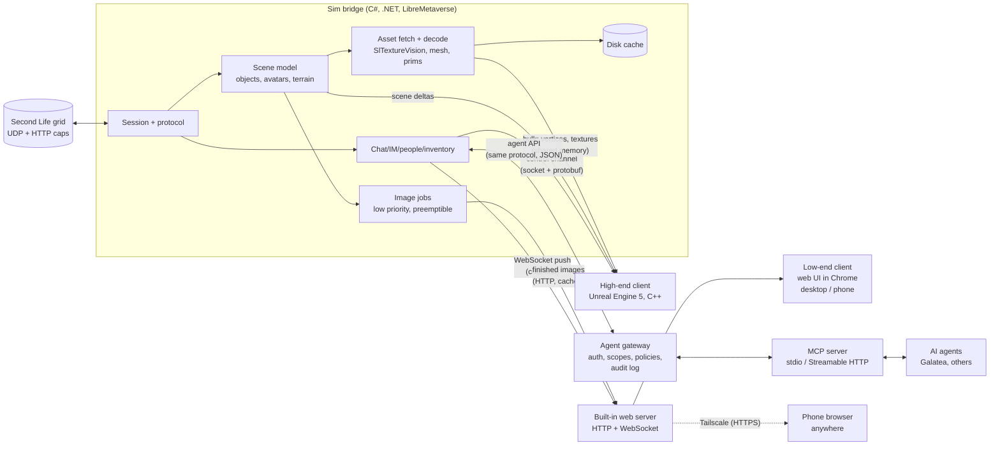

# Galatea viewer: design draft (Unreal high-end mode + chat-first low-end mode)

Status: **draft for David's review**, Oct 3, 2026. Nothing here is built yet. This doc does not change the live text client or the MCP connector. The system is meant for both people and AI agents: the same bridge serves a web UI, a high-end Unreal UI and a documented agent API (§6).

## Decisions log

Every decision David makes goes here, and the sections below are kept consistent with it. All decisions so far are from Oct 3, 2026. They are listed in priority order (build order first, then Galatea/agent decisions, then hardware, then the human clients), not in the order they were made.

| Date | Decision | Where it shows up |
|---|---|---|
| Oct 3, 2026 | **Build order: Galatea's needs first, then full high-end on David's own hardware.** That means the agent API, chat-first operation and Galatea's migration (T1) first, then the Unreal high-end client on David's RTX 4090 / RTX 5090 machines (T2). The web client, the mobile website and common mid-range PCs (T4) and the weakest devices (T3) come later, with broad-target testing as a gate before public release. | §1.1, §9 (M0–M2 T1, M3–M6 T2, M7–M10 T4, M12 gate) |
| Oct 3, 2026 | **Four hardware targets, the first two prioritized:** **T1 (priority)** the AI-agent target, Galatea: headless and GPU-less on the Linux box, no rendering, judged by chat latency, reliability and API completeness (images only on request). **T2 (priority)** David's hardware: full Unreal high-end on the RTX 4090 desktop and RTX 5090 Laptop GPU (Razer), Windows 11. **T3 (later, pre-public)** the lowest scenario: the weakest supported devices (weak laptop, Chromebook or phone on the web client; the weakest GPU high-end supports). **T4 (later, pre-public)** the most common scenario: the web client in Chrome, the mobile website, and common mid-range PCs, sized from cited survey data. Each target has a test profile and budgets. This expands David's approval of the min-spec testing proposal. Buying or borrowing test hardware needs David's OK. | §1.1, §9 (all exits, M12) |
| Oct 3, 2026 | **Agent vision is a core T1 requirement, not optional.** Galatea is headless and GPU-less, but she still needs to *see* what others see sometimes (David: "a core challenge"). The bridge offers `describe_scene`, `look` and `snapshot` with layered back ends: structured scene understanding + 2D scene card always available (d), a CPU render on the box for "good enough" looks (a), and a high-fidelity render on demand (now paid cloud serverless, see below), each falling back to the one below. Firestorm snapshots (e) stay as the stopgap until M2. | §1.1, §6.5, §9 (M0–M2) |
| Oct 3, 2026 | **Paid vision options are approved in principle.** A paid cloud GPU render (c), preferably a serverless container we deploy and pay per second, joins the vision layers for high-quality requests. All spending stays under a monthly budget cap that David sets, with a per-render cost log; when the cap is reached, vision falls back to the free layers. Opening provider accounts and setting or raising the cap still need David's explicit OK. | §6.5, §9 (M1, M2) |
| Oct 3, 2026 | **Galatea's vision never uses David's computers.** The RTX 4090 / RTX 5090 machines may be off or busy rendering David's own avatar, so option (b) is removed from the vision layers. The high-fidelity layer is paid cloud serverless (Runpod Serverless first, Modal second), and the fallback chain is **cloud → box CPU render → scene card**. David's PCs stay for his own high-end client development and testing (T2). | §6.5, §9 (M1–M3) |
| Oct 3, 2026 | **No third-party AI or vision models in agent vision, for now.** No hosted APIs and no open-weight models (not even self-hosted ones on Runpod or the box). Galatea herself does all the understanding of images and scene data. The bridge only delivers pixels and structured facts. Runpod is used only for plain GPU rendering. This replaces the short-lived idea of a "free AI option first" and its model comparison, which was never added. | §4.2, §6.5 |
| Oct 3, 2026 | **First paid cloud test render done (Runpod Serverless, $0.03).** Graphics drivers (EGL/OpenGL, OptiX, Vulkan ICD) work in Runpod containers when `NVIDIA_DRIVER_CAPABILITIES=all` is set. Code in [PR #18](https://github.com/davidabrooks/galatea/pull/18). | §6.5.1 |
| Oct 3, 2026 | **Firestorm is the reference for how SL rendering behaves** (avatar mesh and bakes, BOM, alpha modes, materials, lighting, camera): when unsure, read [phoenix-firestorm](https://github.com/FirestormViewer/phoenix-firestorm) (`indra/newview`, `indra/llrender`). It is LGPL-2.1, so we read it to understand the behavior and write our own implementation; nothing is copied verbatim into the BSD-3 repo. | §6.5, §7 |
| Oct 3, 2026 | **Coding style: [Ponytail](https://github.com/DietrichGebert/ponytail)'s "lazy senior dev" rules (MIT, attributed),** adopted in the repo's `AGENTS.md`. That means YAGNI, reusing what exists, stdlib and installed dependencies first, and the shortest correct diff, but never cutting corners on validation at trust boundaries, data-loss handling or security. Non-trivial logic gets one small runnable check, and every deliberate corner-cut gets a `ponytail:` comment naming its ceiling. | all code; `AGENTS.md` |
| Oct 3, 2026 | **Galatea will eventually use this system for all her SL needs.** She migrates off today's text client onto the shared bridge, keeping every feature she relies on, with a rollback path. Until that cut-over, development never uses her account. (Resolves open question 7.) | §1, §6, §8, §9 (M2) |
| Oct 3, 2026 | **Design principle: open to any AI agent and first-class for humans.** The bridge has a stable, versioned, documented agent API (command/event protocol plus an MCP server), with per-agent auth and permissions. The web UI and the high-end UI are first-class clients of the same bridge, not afterthoughts. | §1, §2, §6, §9 (M0, M1) |
| Oct 3, 2026 | **David creates a separate SL test avatar himself for viewer development.** Its credentials are stored as a secret on the box, never in the repo, logs or docs. (Resolves open question 3.) | §8, §9, §10 |
| Oct 3, 2026 | **High-end targets Windows 11 first,** developed and tested on David's RTX 4090 desktop and RTX 5090 Laptop GPU (Razer). The min-spec target stays lower (RTX 2000 / RX 6000 class) and is covered by T3. (Resolves open question 4.) | §1.1, §8, §9 (M3–M6, M12), §10 |
| Oct 3, 2026 | **Low-end mode has no 3D at all.** It is a chat-first client; pictures are 2D only and made in the background at lower priority than chat. | §1, §4.1–4.3, §9 |
| Oct 3, 2026 | **The low-end client is web-based:** a local web UI served by the bridge, usable from any browser, including a phone. (Resolves open question 2.) | §2, §4.1, §5, §9 |
| Oct 3, 2026 | **The web client targets Chrome first:** desktop Chrome is primary. Chrome on Android/phones and other browsers (Edge, Firefox, Safari/iOS) come in a later milestone. | §4.1, §9 (M10) |
| Oct 3, 2026 | **Tailscale is fine for remote access.** It is the supported way in from outside the PC; no port is opened to the internet. (Resolves open question 9.) | §4.1, §4.6, §9 (M10) |
| Oct 3, 2026 | **Mobile, near term = a mobile website that works anywhere:** the same web client, responsive, reached from the phone over Tailscale from any network (not just the home LAN). **Later = dedicated apps in the iOS App Store and Google Play**, a future milestone. **How they're built is deliberately left open** (a wrapper around the web app, native apps, or a cross-platform toolkit; open question 15). The bridge API stays platform-neutral so any client type works. | §4.1, §4.6, §5, §9 (M10, M14) |
| Oct 3, 2026 | **Voice chat is needed at some point.** It goes in a later milestone, through SL's WebRTC voice. (Resolves open question 8.) | §1, §4.5, §9 (M11) |

## 1. Goals, non-goals, target hardware

**Goals**
- A Second Life viewer with two very different modes that share one connection core:
  - **Low-end mode: chat first, no 3D at all.** Local chat, IM, groups, people, inventory, teleports and offers are the product. They must stay instantly responsive on a weak laptop. Pictures (map tiles, profile pictures, textures, background-made "scene snapshots") are a nice extra, produced at lower priority and never allowed to slow chat down.
  - **High-end mode: full 3D in Unreal Engine 5**, aiming for visuals the official viewer can't reach (Lumen lighting, good post-processing, modern materials).
- Reuse what already works: the C# LibreMetaverse core behind Galatea's text client, and `SlTextureVision` for texture decoding.
- Stay inside Linden Lab's [Third-Party Viewer Policy](https://secondlife.com/corporate/third-party-viewers) from day one.
- **Open to any AI agent, and good for humans** (decided Oct 3). One bridge, one documented protocol: the web UI, the Unreal UI, Galatea and any other agent (via MCP or the raw protocol) are all clients of it, with per-client permissions (§6).
- **Galatea moves onto it** (decided Oct 3): the bridge eventually replaces today's text client for all her SL needs (M2).
- **Mobile anywhere:** the web client works on a phone from any network via Tailscale (M10). Store apps come later (M14).

**Non-goals for now**
- Build tools, mesh upload, the scripting editor, the marketplace, VR.
- Voice in the first milestones. It *is* wanted (see Decisions) but comes later (§4.5, M11).
- Supporting every SL feature in the high-end 3D mode. The fallback for anything missing is "use the official viewer or Firestorm for that."
- Mac/Linux high-end builds in the first year: we target **Windows 11** first (decided Oct 3), on David's machines.

**Hardware, honestly**
- UE5's documented development requirements are a quad-core 2.5 GHz CPU, 32 GB RAM and a DirectX 11/12 GPU with 8 GB+ VRAM. Lumen and Nanite need DirectX 12 with Shader Model 6 hardware: NVIDIA RTX 2000 series, AMD RX 6000 series, Intel Arc A-series or newer ([Epic: hardware and software specifications](https://dev.epicgames.com/documentation/en-us/unreal-engine/hardware-and-software-specifications-for-unreal-engine)). Those are requirements for the editor; a shipped game can run lower, but Lumen/Nanite set the floor for the high-end look.
- For comparison, the official SL viewer's minimum is a GPU with 4 GB VRAM and OpenGL 3.2, recommended 8 GB+ ([SL system requirements](https://secondlife.com/system-requirements)). So SL is already not a "weak computer" app in 3D.
- Epic's own Fortnite runs down to an Intel HD 4000 or Radeon Vega 8 with 8 GB RAM in its low-fidelity "Performance" mode ([Fortnite PC requirements](https://www.epicgames.com/help/en-US/c-Category_Fortnite/c-Fortnite_TechnicalSupport/what-are-the-system-requirements-for-fortnite-on-pc-a000084912)). But that is years of tuning by Epic on hand-authored content. SL content is user-made, unoptimized and streamed live, so we should not expect that.
- **So:** high-end means RTX 2000 / RX 6000 class or better with 16 GB+ RAM (stated plainly). Low-end means anything that runs Chrome comfortably, which is only realistic *because* low-end mode does no 3D (David's call, Oct 3). The bridge itself (a .NET process) runs on a PC or the Linux box; the browser can be on the same machine or another device.

### 1.1 Hardware targets (decided Oct 3: four targets, T1 and T2 first)

The budgets below are **proposed targets**. They get checked against real measurements in M0 (T1), M3 (T2) and M7 (T4 web), and changed if they're unrealistic. Anything marked "from survey" is cited; everything else is our own design choice, not data.

**T1 (priority): AI agent, Galatea, headless on the box.** Linux, no GPU, no display; the bridge runs as a service with agents connected over MCP or the protocol. No continuous rendering. Images are made only when an agent asks. **Agent vision is part of T1** (decided Oct 3, §6.5): Galatea must be able to see a place on request, through the layered `describe_scene` / `look` / `snapshot` calls, without a GPU on the box.
- *Test profile:* the bridge on the box with the test avatar (later Galatea), a scripted agent client sending and receiving chat/IM, plus a soak test (24 h, then 1 week at M2) that includes forced disconnects and region crossings.
- *Budgets:* incoming chat/IM to agent event under 100 ms bridge-side (p99), and agent command to "sent" under 100 ms; zero lost or duplicated IMs/offers across restarts (persisted, as today); automatic re-login within 2 minutes of a drop; no texture, mesh or image traffic unless requested; steady-state RAM and CPU no worse than today's text client on the same box (measured in M0 as the baseline). API completeness means every feature the text client offers today has a documented command/event and an MCP tool (parity checklist). Vision budgets are in §6.5.

**T2 (priority): David's hardware, full high-end.** Desktop with an NVIDIA RTX 4090 and a Razer laptop with an RTX 5090 Laptop GPU, both Windows 11, running the full Unreal high-end client. (The web and mobile clients belong to T4, not here.)
- *Test profile:* Unreal's top scalability presets with Lumen on, at the monitor's native resolution, in a busy region; the laptop also on battery.
- *Budgets:* 16.7 ms per frame (60 fps) or better; VRAM under 16 GB and Unreal process RAM under 16 GB, which leaves headroom on these cards and keeps us honest for smaller ones; chat in the Unreal UI under the 100 ms bridge-side bar while assets stream; SL bandwidth is whatever the viewer's bandwidth setting allows (no extra budget).
- A scaled-down run (lower presets, reduced resolution scale) is logged on these machines from M6 onward for information, so the min spec doesn't drift too far before T3/T4 testing. It doesn't gate a milestone.

**T3 (later, gate before public release): lowest human scenario.**
- *Web client:* a weak laptop or Chromebook with integrated graphics, or a budget phone, on a slow mobile connection reaching the bridge over Tailscale. Test profile: Chrome DevTools CPU and network throttling on David's machines first, then at least one real low-end device.
- *High-end floor:* the weakest GPU we support, RTX 2060 (the lowest desktop card of the RTX 2000 series that Lumen needs, §1; 6 GB VRAM) or an RX 6000-series equivalent, at Unreal's low/medium presets with a reduced resolution scale at 1080p.
- *Budgets:* web client receive-to-screen under 200 ms on the throttled or real device (100 ms stays the bridge-side bar); browser tab memory under 300 MB; bridge-to-phone traffic under 1 Mbit/s while chatting, with images off or on-demand on mobile data. High-end floor at 33.3 ms per frame (30 fps), VRAM under 5 GB, Unreal process RAM under 8 GB.

**T4 (later, gate before public release): most common scenario: the web client in Chrome, the mobile website, and common mid-range PCs.** Linden Lab doesn't publish aggregate hardware statistics for SL users. The viewer does send GPU, CPU and RAM info to LL ([ViewerStats message](https://wiki.secondlife.com/wiki/ViewerStats)), but no public summary exists that we could find. So we use the [Steam Hardware & Software Survey, September 2026](https://store.steampowered.com/hwsurvey/Steam-Hardware-Software-Survey-Welcome-to-Steam) as the best public proxy:
- *From survey:* most common GPU **NVIDIA GeForce RTX 5070** (5.86%); system RAM **32 GB** (42.22%, then 16 GB at 37.82%); VRAM 16 GB (27.21%) and 8 GB (26.71%) nearly tied; **8 physical CPU cores** (30.06%, then 6 cores at 27.23%); primary display **1920×1080** (47.91%); **Windows 11 64-bit** (71.34%).
- Steam measures gamers, who likely skew higher than typical SL users; SL's own recommended spec is 16 GB RAM and an 8 GB+ GPU ([SL system requirements](https://secondlife.com/system-requirements)). So the T4 budgets use the more conservative runner-up values.
- *Test profile, web and mobile (the main T4 clients):* the web client in desktop Chrome on a mid-range PC at 1920×1080, and the mobile website in Chrome on Android and Safari on iOS over Tailscale on mobile data. Until real devices are approved, desktop Chrome on any machine and David's own phone stand in.
- *Test profile, high-end on a common PC:* an RTX 5070-class GPU at 1920×1080 with Unreal's medium/high presets and Lumen on, capped to 8 GB VRAM use and 16 GB system RAM.
- *Budgets:* web client and mobile website receive-to-screen under 100 ms with image work saturated (bridge-side and in the browser); browser tab memory under 500 MB on desktop; reconnect-and-catch-up within 5 s after a network switch on the phone. High-end on a common PC: 16.7 ms per frame (60 fps) in a typical region and 33.3 ms (30 fps) worst case in a busy one; VRAM under 7 GB; Unreal process RAM under 10 GB.

**Test hardware:** T1 and T2 need nothing new (the box and David's machines). T3 and T4 need real devices eventually (e.g. a low-end Chromebook or budget phone, a mid-range Android phone and an iPhone, an RTX 2060-class card, an RTX 5070-class card). **Buying or borrowing any test hardware needs David's OK.** Until then, throttling and scaled-down presets on David's machines stand in.

## 2. Architecture

### 2.1 Overall shape

**One rule: the sim bridge owns the SL session.** Both front ends are views onto it. For low-end mode the bridge also contains a small web server that serves the web UI, so "installing low-end mode" means running the bridge and opening a page in Chrome. This is the text client's current shape, where the MCP connector and the CLI already talk to one process over a local socket, so we grow something that already works. Every client, human or agent, goes through the same command/event protocol and the same policy layer (§6), so a safety rule written once applies to everyone.

### 2.2 Why a C# sidecar instead of porting the protocol to C++

| Option | Pros | Cons |
|---|---|---|
| **A. C# bridge process (recommended)** | LibreMetaverse is BSD-3-Clause like galatea; it already handles login, caps, IMs, inventory, prims and sculpts (`PrimMesher`) and is proven daily by Galatea; a bridge crash doesn't take down the renderer and vice versa; low-end mode needs no Unreal at all. | Two processes, and an IPC layer to design; bulk data (meshes, textures) must cross a process boundary. |
| B. Port the protocol to C++ inside Unreal | One process, no IPC. | A large rewrite of mature code; we'd re-find years of protocol edge cases. |
| C. Reuse LL viewer C++ code (LGPL 2.1) | Authoritative protocol and rendering logic. | Unreal's EULA forbids combining the engine with LGPL code "unless you are merely dynamically linking a shared library" ([Unreal EULA, Non-Compatible Licenses](https://www.unrealengine.com/eula/unreal)). It's workable only as a separate DLL, the [viewer code](https://github.com/secondlife/viewer) is tightly coupled, and changes to it must be published under LGPL ([LL licensing](https://wiki.secondlife.com/wiki/Linden_Lab_Official:Second_Life_Viewer_Licensing_Program)). |
| D. C# inside Unreal via [UnrealSharp](https://github.com/UnrealSharp/UnrealSharp) | Same language as the core, in one process. | Young plugin that tracks recent UE versions; we'd tie session stability to it; and it doesn't help low-end mode. Worth a spike later, not as the foundation. |

### 2.3 IPC between bridge and front ends

- **Web client (low-end):** the browser loads static pages over HTTP from the bridge, then opens one **WebSocket**. The bridge pushes chat, IM, presence and offers over it the moment they arrive, and the page sends commands back (send IM, teleport, accept offer). Messages are small JSON objects (easy to debug in Chrome DevTools; binary can come later if ever needed). Images are plain HTTP URLs served from the bridge's cache, so Chrome's own image cache helps and an image never travels on the chat socket.
- **Control channel (high-end):** chat, IM, presence, commands and scene deltas (object added/moved/removed). These are small, frequent messages that must arrive in order. Use a local socket (Unix socket on Linux, named pipe on Windows) with length-prefixed **protobuf** messages.
  - **gRPC** is the polished version of this, with streaming and code generation. But it adds per-call RPC overhead and a heavy dependency for a same-machine link (see the discussion in [F. Werner, gRPC for local IPC](https://www.mpi-hd.mpg.de/personalhomes/fwerner/research/2021/09/grpc-for-ipc/)), and Unreal doesn't ship a gRPC client. Plain socket + protobuf is easy to call from C++ and C#. Both channels carry the same message types, defined once.
- **Bulk channel (high-end only):** decoded textures (RGBA mips) and mesh buffers go through **shared memory** (a ring of named memory-mapped regions). The control channel only carries a handle saying "texture X is ready at offset N". [FlatBuffers](https://github.com/google/flatbuffers) headers in the shared memory let Unreal read the data without parsing it.
- **Agent API (any AI agent):** the same JSON commands and events as the web client, over the same WebSocket or a local socket, plus an MCP server on top (§6). One schema, versioned, generates the docs and the protobuf/JSON bindings.
- **Priorities:** the control channel always has its own thread and is never blocked by asset traffic. Chat and IM messages sit at the head of the queue (see §4.3).

## 3. Content pipeline (high-end mode; partly reused by low-end images)

| Content | Source | Plan |
|---|---|---|
| **Prims** | Shape parameters in ObjectUpdate | Generate geometry in the bridge with LibreMetaverse `PrimMesher`; send vertex/index buffers to Unreal as runtime meshes (`DynamicMeshComponent`/`ProceduralMeshComponent`). Cache by shape hash. |
| **Sculpties** | Sculpt map texture | `PrimMesher` `SculptMesh` after decoding the map with SlTextureVision. |
| **Mesh** | Mesh asset: LLSD header + gzip'd LOD blocks, physics stored separately ([SL Mesh Asset Format](https://wiki.secondlife.com/wiki/Mesh/Mesh_Asset_Format)) | Decode in the bridge, keep all four LODs, pick the LOD in Unreal by screen size. |
| **Textures** | JPEG2000 | Decode in the bridge with SlTextureVision (already in galatea) and pass RGBA mips via shared memory → `UTexture2D` created at runtime. Textures can now be up to 2048×2048 ([SL release notes 7.1.7](https://releasenotes.secondlife.com/viewer/7.1.7.8883017948.html)), so stream by distance and screen size. |
| **Materials** | Legacy diffuse/normal/specular; glTF PBR since Nov 2023 ([SL PBR release](https://releasenotes.secondlife.com/viewer/7.0.1.6894459864.html)) | Two Unreal master materials: "legacy" and "glTF metallic-roughness". glTF maps onto UE's PBR model cleanly; legacy specular is approximated. |
| **Avatars** | Base avatar + Bento skeleton (106 extra bones: [Bento guide](https://wiki.secondlife.com/wiki/Project_Bento_Skeleton_Guide)), rigged mesh bodies and heads, alpha layers, [Bakes on Mesh](https://community.secondlife.com/knowledgebase/english/bakes-on-mesh-r1512/) | Build one Unreal skeleton matching SL's. Rigged mesh attachments become skeletal meshes bound to it. This is the hardest part: creating skeletal meshes at runtime is much less paved in Unreal than static meshes, so it gets its own milestone. Server-side bakes arrive as textures (easy); alpha masks need a custom material. |
| **Animations** | SL's own keyframe animation assets (uploaded as BVH or `.anim`) | Decode in the bridge and drive the skeleton with a runtime animation player (pose-by-pose at first, a proper anim graph later). |
| **Terrain** | Land patch packets (the text client already stores them for walking) + terrain textures / PBR terrain | Heightfield mesh per region; terrain material blends the 4 textures by height like SL. |
| **Water, sky** | Region/parcel environment ([EEP](https://wiki.secondlife.com/wiki/Environmental_Enhancement_Project)) | Map EEP sun/moon/haze/water settings onto UE Sky Atmosphere, Volumetric Clouds and a water plane. It will look different from SL, deliberately better. |
| **Streaming** | The sim's interest list sends objects nearest/most active first; cached objects arrive as `ObjectUpdateCached` + CRC ([ObjectUpdateCached](https://wiki.secondlife.com/wiki/ObjectUpdateCached)) | Bridge keeps a persistent object cache keyed by ID+CRC (like the official viewer), so revisits are fast. Unreal gets deltas, not snapshots. |
| **Cache** | Disk | Bridge-owned: decoded textures (by asset ID + discard level), meshes, prim geometry hashes. Shared by both modes. |

**Nanite reality check:** Nanite meshes are normally built offline when content is cooked. Stock UE5 has no supported path to turn runtime-created meshes into Nanite ([Nanite docs](https://dev.epicgames.com/documentation/en-us/unreal-engine/nanite-virtualized-geometry-in-unreal-engine); [Epic forum thread](https://forums.unrealengine.com/t/is-generation-of-nanite-meshes-during-runtime-possible/655107)). Third-party plugins claim runtime Nanite builds with real costs ([RealtimeMesh docs](https://triaxis.games/realtime-mesh/docs/rendering/nanite/)). Since all SL content arrives at runtime, **plan without Nanite**. Use classic LODs (SL mesh already has 4), and maybe try Nanite later for big static meshes we can build in the background and cache.

## 4. The two modes

### 4.1 Low-end mode: chat first, no 3D

**What it is:** a fast text client with a good-looking 2D interface. It's what Galatea's text client already does, plus a human-friendly UI and pictures that show up when they're ready.

**Decided (Oct 3): a local web UI served by the bridge, Chrome first.**
- No Unreal in low-end mode. Unreal (even with only Slate/UMG 2D) would bring a large install, a GPU-backed window, Unreal's startup time and the EULA, all to draw text boxes and images. The web client ships without any Epic code and stays BSD and royalty-free.
- The bridge serves plain HTML/CSS/JavaScript plus one WebSocket (§2.3). No build-heavy front-end framework is required at first; a small one can be added if the UI grows.
- **Desktop Chrome is the target and the test browser.** We develop and measure against it (Chrome DevTools for the latency checks). Responsive layout is designed in from the start so a phone works later, but the phone (the mobile website, §4.6) and other browsers are tested and fixed in their own milestone (M10).
- The page keeps working if the WebSocket drops: it reconnects and asks the bridge for everything missed since its last message ID, so a sleeping laptop or a phone switching networks doesn't lose chat.

**Access and security (implications of a web UI):**
- **Local-only by default.** The bridge listens on `127.0.0.1` only, so nothing else on the network can reach it.
- **Phone or another PC (decided Oct 3: Tailscale):** don't open a port to the internet. The supported route is [Tailscale Serve](https://tailscale.com/docs/features/tailscale-serve), which exposes a local service only to devices in your own tailnet over HTTPS with an automatically provisioned certificate. Because the phone runs the Tailscale app, this works from any network (home Wi-Fi, mobile data, a café), not just the home LAN. LAN-only access stays possible as an explicit opt-in. Not Tailscale *Funnel*, which would publish the page to the whole internet.
- **Login to the web UI:** even locally, the page needs a per-install secret (a token in the URL the bridge prints once, kept as a cookie), so another app or website in the same browser can't drive the session. The WebSocket checks the page's origin.
- **HTTPS matters for voice:** Chrome only allows the microphone in a secure context, meaning HTTPS or `localhost` ([MDN: getUserMedia](https://developer.mozilla.org/en-US/docs/Web/API/MediaDevices/getUserMedia); [MDN: secure contexts](https://developer.mozilla.org/en-US/docs/Web/Security/Defenses/Secure_Contexts)). Desktop on the same PC is fine over `http://localhost`; a phone needs HTTPS, which the Tailscale route provides (and which an installable home-screen web app needs too, §4.6).
- Agents get their own tokens with limited scopes, separate from the human UI's token (§6).
- The SL password is entered once at the bridge, never stored in the browser, and never sent anywhere except Linden Lab's login server.

**Responsiveness rules** (testable, see M7):
- Chat/IM input-to-send and receive-to-display under 100 ms on the bridge's side, whatever image work is running.
- Image work runs on a separate low-priority worker pool and is *preemptible*: it checks a cancel flag between steps and yields when chat traffic arrives.
- The UI never waits on an image. Placeholders appear first, and images replace them when ready.
- In the browser: chat arrives over the WebSocket and is drawn immediately. Images load lazily (only when visible), and the page never blocks rendering on them.

### 4.2 Where the 2D pictures come from

Ordered from cheapest to most ambitious:

1. **Map tiles:** the official Map API serves region images from `map.secondlife.com/map-{z}-{x}-{y}-objects.jpg` ([Map API intro](https://wiki.secondlife.com/wiki/Linden_Lab_Official:Map_API_Introduction)). Free, accurate for layout, and official. Overlay avatar dots from the bridge's positions. **Do first.**
2. **Profile pictures, place pictures, textures:** fetched like any viewer does and decoded with SlTextureVision. They show who you're talking to and what something looks like (e.g. a vendor board). Cheap and accurate. **Do first.**
3. **Composited 2D scene image:** the bridge already knows nearby objects, avatars, their positions and textures. It can lay out a top-down or "isometric card" view: the map tile as the floor, object footprints tinted by their main texture, avatars as profile pictures at their positions. Cheap and runs fully locally. It isn't a photo, but it's honest about what's there. **Do second.**
4. **Software-rendered snapshot on the user's own machine:** rasterize a low-resolution 3D view on the CPU, with no GPU needed, in the background every N seconds while idle (e.g. using our prim/mesh geometry and textures). Medium effort, accurate, slow on weak CPUs but preemptible. A good "later" option.
5. **Render by a high-end instance ("cloud/remote render"):** a strong machine renders real 3D views and sends images. Tradeoffs:
   - A remote renderer needs its *own SL session*. SL allows one login per account, so either the user's own session moves there (then it's really game streaming), or it's a separate bot account, which follows SL's bot rules ([TPV policy §4.a.iii](https://secondlife.com/corporate/third-party-viewers)) and only sees what's near *it*.
   - Sending other residents' content to a server is not "export" under §2.b, but it is user data. It needs a published privacy policy (§4.b) and care around privacy options (§2.a.iii).
   - It also costs GPU servers. **Not recommended** except as an opt-in for David's own setup (e.g. his PC renders for his laptop at home).
6. **AI-generated illustration from a scene description** ("a campfire at dusk, two avatars sitting, pine trees"):
   - Pretty, but *invented*: it will show things that aren't there and get people's looks wrong, which matters socially in SL.
   - It costs money per image if hosted, and it sends descriptions of people and places to a third party, which again needs privacy-policy disclosure.
   - Fine as an optional "mood picture" clearly labeled as illustration. Never present it as what's actually there.
   - **Not used for now** (Oct 3): no third-party AI or vision models anywhere in agent vision.

**Recommendation:** ship 1+2+3. Consider 4 next. Keep 5 and 6 opt-in experiments, clearly labeled.

### 4.3 Priority scheduler (shared by both modes)

- **P0, never queued behind anything:** incoming/outgoing chat and IM, teleport/friendship/group offers, presence, region-restart warnings.
- **P1:** UI state (people list, inventory listing, map position).
- **P2:** visible-now assets (the profile picture of the person you're talking to, the map tile you're on).
- **P3:** background (composited scene images, prefetch, cache cleanup).

How it's built:
- A separate thread for P0 with its own socket queue.
- A bounded worker pool for P2/P3 that pauses whenever P0 traffic arrives within the last ~2 s.
- Download bandwidth for P3 is throttled so a big texture never fills the connection during a conversation.

### 4.4 High-end mode: full 3D in Unreal

- Deferred renderer with **Lumen** global illumination and reflections, Virtual Shadow Maps, Sky Atmosphere and volumetric clouds for EEP skies, TSR upscaling for frame rate.
- Content uses classic LODs (no Nanite, §3). Distant objects can fall back to cached **impostors**: billboards rendered once from the object.
- A scalability menu (Unreal's built-in quality presets) lets mid-range cards (e.g. GTX 10-series) run without Lumen. But below RTX/RX 6000 class, we tell users to choose low-end mode.

### 4.5 Voice (decided Oct 3: needed, later milestone)

- **What SL uses:** SL historically used Vivox and is replacing it with its own WebRTC voice service ([SL wiki: WebRTC Voice](https://wiki.secondlife.com/wiki/WebRTC_Voice)). The full grid-wide WebRTC deployment was announced for May 5, 2026, and viewers that rely only on Vivox lose voice once Vivox is switched off ([Inara Pey, May 4, 2026](https://modemworld.me/2026/05/04/be-ready-webrtc-goes-grid-wide-in-second-life-may-5th-2026/)). **So we build WebRTC voice only, no Vivox.** We should confirm the switch-over really completed before M11.
- **Why it fits the web client:** WebRTC is built into Chrome (microphone access, echo cancellation, audio codecs). Being built into most browsers is part of why LL picked it (same Inara Pey post).
- **Two ways to wire it**, to be decided by a spike:
  - **(A) Browser does the audio:** the bridge only does the SL side: asking the region for a voice session and passing the WebRTC offer/answer between Chrome and SL's voice server. Chrome then talks to the voice server directly. Nicest audio and lowest bridge load. Unverified risks: whether SL's voice servers accept a browser as a peer as-is, and how the bridge must relay connection details.
  - **(B) Bridge does the audio:** LibreMetaverse already contains a C# WebRTC voice client (`LibreMetaverse.Voice.WebRTC`, built on SIPSorcery, in our vendored copy). The bridge joins voice itself and streams audio to and from the page. More moving parts and latency, but it doesn't depend on (A)'s unknowns, and the high-end Unreal client could reuse it.
  - Plan: try (A) first in M11; fall back to (B).
- **Constraints:**
  - Microphone needs HTTPS or localhost in Chrome (§4.1).
  - Push-to-talk by default, and the mic is off until the user turns it on.
  - Spatial voice (louder when closer) is done by SL's voice service, which got an HRTF spatialization update during the rollout ([Inara Pey, Nov 25, 2025](https://modemworld.me/2025/11/25/)); we should not reimplement it.
  - Voice is P0 traffic in the scheduler (§4.3), right next to chat.
  - Galatea never joins voice unless David explicitly asks.

### 4.6 Mobile (decided Oct 3: mobile website first, store apps later)

- **Near term: a mobile website.** It is the same web client the bridge serves, with a responsive phone layout. No separate code base.
- **Works anywhere:** the phone reaches the bridge over Tailscale (decided Oct 3) from any network. The bridge keeps running on an always-on machine (David's PC or the box), and the phone is just a browser tab, so closing it doesn't log the avatar out. When the tab reopens, it catches up from the last message ID (§4.1).
- **Add to home screen:** with a web app manifest, served over HTTPS (which Tailscale Serve provides), Chrome can install the site like an app ([MDN: making PWAs installable](https://developer.mozilla.org/en-US/docs/Web/Progressive_web_apps/Guides/Making_PWAs_installable)). That's cheap, so it's in M10.
- **Notifications while the phone is locked** are the main weak spot of a website:
  - Web Push needs a service worker ([MDN: Push API](https://developer.mozilla.org/en-US/docs/Web/API/Push_API)). It works in Chrome on Android.
  - On iOS, web push works only for web apps added to the home screen, on iOS 16.4 or later ([OneSignal: web push for iOS](https://documentation.onesignal.com/docs/en/web-push-for-ios)).
  - Push messages travel through the browser vendor's push service, i.e. Google's or Apple's ([MDN: offline and background operation](https://developer.mozilla.org/en-US/docs/Web/Progressive_web_apps/Guides/Offline_and_background_operation)). Send only "new IM" with no message text, and let the page fetch the content over Tailscale.
  - The bridge would need to reach the push service from the PC. That's fine (outbound only), but it's an extra moving part, so push is optional in M10 and properly done in M14.
- **Later: dedicated store apps (iOS App Store, Google Play), M14.** **Not decided whether they reuse the web app** (open question 15). The options are: a wrapper around the web app (e.g. [Capacitor](https://capacitorjs.com/docs) or PWA store packaging); fully native apps (Swift/Kotlin); or a cross-platform toolkit ([React Native](https://reactnative.dev/), [Flutter](https://flutter.dev/), [.NET MAUI](https://learn.microsoft.com/dotnet/maui/)). Any store app gives more reliable notifications and background behaviour, a normal app icon and store discovery. The cost is store accounts and review, and listing it publicly counts as distributing a viewer, so the TPV obligations (privacy policy, disclosures, §7) apply first. It also has to answer "how does the app reach the bridge" for users without Tailscale (see the relay tradeoff below).
- **Tailscale vs. a relay (tradeoff):**
  - **Tailscale (chosen):** no server for us to run, end-to-end encrypted, no port opened, free for personal use. The downside: every phone needs the Tailscale app and has to join the tailnet, which is fine for David and awkward for strangers.
  - **Our own hosted relay** (bridge and phone both connect out to a server we run): no extra app on the phone, so it's friendlier for a public store app. The downsides: it costs money, it's a security target that sees everyone's session traffic unless we add end-to-end encryption, and it brings privacy-policy and data-handling duties under the TPV policy. **Not planned**; it's only revisited if the store apps (M14) need it.

## 5. UI

- **Both modes:**
  - Local chat with distances and names
  - IM tabs (shows our duplicate-send guard state)
  - Group chat
  - People nearby and friends
  - Inventory (browse, wear/detach, give)
  - World map with search and teleport
  - Offers inbox (friendship, inventory, group invites; the same rules as today)
  - Notifications
  - Profiles
- **Low-end (web, Chrome first):**
  - Chat is the center of the screen.
  - Responsive layout: on a wide screen, chat + side panels; on a phone (the mobile website, §4.6), chat full-screen with panels as tabs.
  - Chrome desktop notifications (with permission) for IMs and offers when the tab is in the background.
  - A side panel shows the current "scene card" (map tile + composited image) and the person you're talking to.
  - Keyboard first on desktop, large touch targets on phones.
- **High-end:** Unreal UMG panels over the 3D view, with the same panels as low-end so habits transfer. (A later option: show the web UI inside Unreal's built-in web browser widget so we build the panels once.)
- **HUDs:** in 3D, render HUD attachments as screen-space prims. In low-end, show a list of the HUD's buttons (prim names), backed by what `worn links` / `touch-attachment` already do.
- **Build tools:** deferred (non-goal for now).
- **Agents are visible to humans:** a panel lists the connected agents, what scopes they have and what they did recently (from the audit log, §6). A human can pause or revoke an agent from there. Messages an agent sends are marked as agent-sent in the local history.

## 6. Agent API: any AI agent and humans on one bridge (decided Oct 3)

**Principle:** the bridge is a general-purpose SL session server. Humans (web UI, Unreal UI, phone) and AI agents (Galatea, or any other agent via MCP or the raw protocol) are all clients of the same bridge, see the same event stream and go through the same rules. The web UI uses only the public protocol, with no private back door, so the API stays complete and tested.

### 6.1 The protocol

- **Commands and events, versioned.** Commands are things like `chat.say`, `im.send`, `move.teleport`, `offer.accept` and `inventory.wear`. Events are things like `chat.received`, `im.received`, `presence.changed` and `offer.received`. Each event has a monotonically increasing ID so any client can reconnect and ask for what it missed.
- **One schema, written once** (JSON Schema or protobuf), from which the docs, the JSON over WebSocket and the protobuf for Unreal are all generated. A client states the protocol version it speaks; changes within a major version are additive only, and breaking changes bump the major version with a deprecation period.
- **Transports:** the WebSocket (same as the web UI) and a local socket. Replies are structured: ok, error with a code, or `skipped` with a reason (as today's IM guard does).
- **Platform-neutral:** plain JSON over WebSocket/HTTP (plus protobuf for Unreal) with no browser-only or .NET-only assumptions, so a web page, an Unreal client, a native iOS/Android app, a cross-platform app (React Native, Flutter, .NET MAUI) or an AI agent can all be clients. Auth uses bearer tokens, not cookies alone, so non-browser clients work too.
- **Documented publicly** in the repo, with examples and a small reference client, so an agent author can start without reading bridge code.

### 6.2 MCP server interface

- The bridge ships an MCP server that exposes the protocol as MCP tools (send IM, read recent chat, nearby, teleport, accept offer, ...) and resources (chat history, people nearby), like today's text-client connector but generic.
- **Transports** per the MCP spec: **stdio** for an agent on the same machine and **Streamable HTTP** for remote agents ([MCP: transports](https://modelcontextprotocol.io/specification/2025-03-26/basic/transports)). For HTTP the spec requires validating the `Origin` header, recommends binding to localhost when running locally, and calls for proper authentication. Remote agents come in over Tailscale, like the phone.
- **Auth for HTTP** follows the [MCP authorization spec](https://modelcontextprotocol.io/specification/2026-07-28/basic/authorization): OAuth 2.1-style bearer tokens on every request, and HTTP 401 for a missing or invalid token. For a single-user install, a token issued by the bridge's UI is enough at first; a full OAuth flow comes if third parties use it.

### 6.3 Per-agent auth, permissions and policies

- **Each client gets its own token** with a name and a set of scopes, and a human approves it in the UI. Revoking a token cuts that client off immediately.
- **Scopes (draft):** `chat.read`, `im.read`, `chat.send`, `im.send`, `move` (walk, sit, follow), `teleport`, `inventory.read`, `inventory.wear`, `offers.accept`, `profile.edit`. **`money` (paying or accepting L$ charges) is never granted by default** and needs a separate, explicit human approval, mirroring today's L$ rule.
- **Bridge-level policies apply to every client, human UIs included where it makes sense:** today's per-recipient IM duplicate guard and heads-up rule, rate limits per client, the money rule, the offers policy (e.g. the Sunrise Suites L$0 auto-accept rule) and the webhook daily cap. They move from the text client into the bridge, so a new agent gets them for free.
- **Audit log:** every command records who sent it (which human UI or agent), when, and the result. The UI shows it (§5).
- **Humans and agents together:** several clients can be connected at once. Every command is attributed. A human can switch an agent to "read-only" or "paused" while they drive. Agents don't log in or out without the right scope.

### 6.4 Second Life's rules for AI-driven accounts

- Linden Lab's [Scripted Agent Policy](https://wiki.secondlife.com/wiki/Linden_Lab_Official:Scripted_Agent_Policy) requires accounts that are primarily operated by software to be marked as scripted agents in their account settings. The bridge's docs must say this plainly for anyone connecting an agent.
- Estates can refuse scripted agents (the `deny_bots` access setting; [LL: scripted agent estate access FAQ](https://lindenlab.freshdesk.com/support/solutions/articles/31000169561-scripted-agent-estate-access-faq)). The bridge should report such a refusal clearly to the agent instead of retrying.
- The TPV policy still applies to the bridge as a viewer, whoever drives it (§7).

### 6.5 Agent vision: letting a headless agent see (decided Oct 3: core T1 requirement)

**The problem.** Galatea runs headless on the box (T1): no GPU, no display. But sometimes she needs to *see* what others see: how a place looks, what someone is wearing, whether she's sitting right, what's on a sign. David calls this a core challenge, and it's part of T1, not an optional extra.

**What the box can actually run** (measured, [client-options.md](../../client-options.md)): Debian 13, 8 vCPUs, about 16 GB RAM shared, no GPU, no root. Firestorm on Mesa's llvmpipe software renderer ran at about 6–7 fps in an 800×500 window, using 260–280% CPU and 2–5 GB RAM. So real SL scenes *can* be drawn on this CPU, just slowly and expensively. That's fine for a single frame on request, but not for continuous rendering next to Galatea's chat.

**Whose session sees the scene.** SL allows one session per account. Any renderer that isn't inside the bridge can't log in as Galatea without kicking her. So the cloud renderer (c) doesn't log in at all: they get the scene from Galatea's bridge (objects, positions, asset IDs, avatar bakes, the camera pose) and fetch assets through the bridge or their own cache. That way they draw exactly what *her* session knows about, which is the closest thing to "what others see" around her.

#### Options compared

| Option | Fidelity | Latency (target, per request) | Cost | Runs on the box? | Main risks |
|---|---|---|---|---|---|
| **(d) Structured scene understanding, no pixels:** object list with names, positions, sizes and main textures/colors; avatars with position, sit/animation state and attachments; parcel, region, sky. Plus a composited 2D **scene card** (map tile floor, object footprints tinted by texture, avatars as profile pictures; §4.2 option 3) (SlTextureVision already decodes textures for her today). Galatea interprets all of it herself; no third-party vision model is involved (decided Oct 3). | Accurate about *what* is where and who; not a picture. Misses lighting, shapes of mesh, how an outfit actually looks on a body. | Data under 2 s from the bridge's scene model; scene card under 5 s. | Free (local). | Yes, easily. | "Accurate but abstract": can mislead about appearance. |
| **(a) CPU software render on the box:** our own small headless renderer in the bridge: terrain, prims (PrimMesher), mesh LODs, textures via SlTextureVision, simple sun/ambient lighting, avatar bakes on a basic body. Either a plain C# rasterizer (no graphics stack needed) or OpenGL on llvmpipe ([Mesa llvmpipe](https://docs.mesa3d.org/drivers/llvmpipe.html)). Note: Mesa's off-screen library OSMesa was removed in Mesa 25.1; the suggested replacement is an EGL surfaceless context ([Mesa 25.1 notes](https://docs.mesa3d.org/relnotes/25.1.0.html); [removal commit discussion](https://github.com/conda-forge/mesalib-feedstock/issues/109)). The box has Mesa 25.0 with GLX/llvmpipe but no EGL packages installed, and no root, so a pure C# rasterizer is the lowest-risk path. A UE build with software rendering is **not feasible**: Epic's documented requirements are all hardware GPUs (§1). | "Good enough": recognizable place, objects, colors and avatar shapes; no Lumen-style lighting, no alpha-heavy effects, simplified avatars (rigged mesh is the hard part). | low (512×512, 64 m): under 10 s. medium (1024×768, mesh + textures): under 30 s. | Free (box CPU). Capped at 2–4 of the 8 cores, low priority, preemptible (P3, §4.3). | Yes, as a single frame on request. | Real engineering effort (a mini-renderer); rigged mesh avatars and alpha are hard. For how SL does these (BOM bakes, alpha modes, materials, sky/sun lighting, camera), Firestorm's `indra/newview` and `indra/llrender` are the reference: we read them and reimplement (LGPL, §7). |
| ~~**(b) Render request to a high-end instance on David's PC**~~ **Rejected Oct 3 (David): Galatea's vision must not use his computers, which may be off or busy with his own avatar.** Kept here for the record. (RTX 4090 / RTX 5090 over Tailscale): the bridge sends the scene + camera to the Unreal client running as a renderer, which returns a snapshot or short clip through the bridge API. | Highest: real 3D, real lighting, mesh avatars (once M5 lands). | Warm (renderer running, region cached): under 30 s for a snapshot, under 60 s for a clip of up to 10 s. Cold (region assets not cached): up to about 3 min. | Free in money; uses David's GPU and power. | No: needs David's PC on and the renderer running. | PC off or busy (David playing). Assets have to cross Tailscale (session caps URLs are secrets, so the bridge proxies them). Needs the T2 high-end work first (M3+). |
| **(c) Paid cloud GPU render on demand** (approved in principle Oct 3; details in §6.5.1) | At first the (a) renderer running on a GPU (higher resolution, better lighting); later a Linux build of the Unreal client for real 3D lighting and mesh avatars. | Serverless: est. 30–90 s cold, 5–15 s warm. VM: est. 3–6 min cold. | Serverless: est. $0.01–0.03 per cold snapshot, under $0.005 warm (§6.5.1). | No (remote). | Costs money (budget cap + cost log), graphics drivers in containers must be verified, scenes of other residents leave the house (privacy), another account to secure. |
| **(e) Today's stopgap: Firestorm snapshots** on the box (llvmpipe, `run-firestorm.sh`). | Real SL rendering (at the box's low settings). | Minutes: Galatea has to log out of the text client, Firestorm logs in (one session per account), renders at about 6–7 fps, takes the snapshot, then she logs back in. | Free, but 2–5 GB RAM and 260–280% CPU while it runs. | Yes, but heavy. | Galatea is offline in the text client meanwhile; GUI-driven and brittle (README: "Snapshots still need Firestorm"). |

#### 6.5.1 Paid cloud rendering (approved in principle Oct 3)

**How a cloud render works.** The cloud renderer never logs in to SL (one session per account). The bridge on the box builds a **scene package** for the request: the visible objects as glTF, the textures it has already decoded, avatar bakes, sun/sky settings and the camera pose. It uploads the package to the renderer, which returns a JPEG/PNG (or a short clip). The renderer is stateless, which fits "pay per render" well. It starts as the (a) renderer compiled for a GPU (OpenGL via EGL, or Vulkan), and can later become a Linux build of the Unreal client for full fidelity (after M5, avatars).

**Technical catch to verify first.** Rendering needs the GPU's *graphics* stack (EGL/OpenGL or Vulkan), not just CUDA. In containers the NVIDIA driver only exposes `compute,utility` by default; rendering needs `graphics` (and `display` for Vulkan) or it silently falls back to CPU llvmpipe ([selkies EGL container notes](https://github.com/selkies-project/docker-selkies-egl-desktop); [headless EEVEE on CPU vs GPU](https://github.com/shotaro-kajiyama/blender-eevee-gpu-headless)). Modal documents its CUDA stack but not EGL/Vulkan ([Modal: CUDA](https://modal.com/docs/guide/cuda)), so **graphics support on each serverless provider must be proven in the spike**. GPUs aimed at graphics (L4, L40S, A10, RTX cards) fit better than compute-only data-center parts; NVIDIA's own Brev catalog lists L40S/L40 and RTX parts for rendering ([Brev GPU types](https://docs.nvidia.com/brev/reference/gpu-types)).

**First test, Oct 3, 2026 ([PR #18](https://github.com/davidabrooks/galatea/pull/18); measured, not estimated).** The scene came from Galatea's text client, read-only: 204 objects as textured boxes with 87 textures from SL's public asset CDN, plus terrain at Naberrie (Buddha Center landing). The face is a procedural stand-in because the text client doesn't expose her LeLutka EvoX mesh or server-side bakes. Rendering used Blender 4.2 on Runpod Serverless (stock `nvidia/cuda` image, flex, max 1 worker, 5 s idle).
- GPU: RTX A4500 20 GB (16 GB pool), driver 570. **Graphics drivers work** once `NVIDIA_DRIVER_CAPABILITIES=all` is set: the NVIDIA EGL/GLX libraries, OptiX, rtcore, the EGL vendor file and the Vulkan ICD were all present. Cycles ran on OptiX and EEVEE on NVIDIA OpenGL 4.6 (not llvmpipe). Vulkan was present but untested.
- Times: 91 s cold start (69 s of it was installing Blender at boot; a baked image should cut most of that), then 91 s of execution. Within that, textures took 6 s, the Cycles scene 8 s (960×540), the Cycles face 2 s, and the EEVEE scene 74 s (first-run shader compile, so Cycles is the default for now).
- Cost: **$0.0303 for the whole job** (3 renders, about 189 s billed at ≈ $0.00016/s), from the account balance before and after. That's in line with the cold estimate below. Logged in `/workspace/secondlife/render-cost-log.md`. The endpoint was scaled to 0 workers afterwards.
- Next for fidelity: real geometry (mesh LODs, all faces and alpha) exported by the bridge, and avatar bakes. That needs bridge work, not more GPU.

**Second test, Oct 3, 2026: real geometry and her real avatar ([PR #18](https://github.com/davidabrooks/galatea/pull/18)).** A new read-only `scene export` command in the text client dumps every prim (path/profile parameters, sculpt and mesh asset IDs, per-face textures and colours) plus her attachments, and fetches her server-side bakes from the appearance service. An offline tool on the box (`vision/scene-mesher`, no login) builds the geometry with LibreMetaverse's own meshers: PrimMesher for prims, sculpt maps, and mesh LODs from the public asset CDN. Rigged attachments are posed in bind pose on the default skeleton (LibreMetaverse's copy of `avatar_skeleton.xml`), including collision volumes for fitted mesh and joint-position overrides. That's the T-pose, not SL's animated default stand. BOM faces get the head/upper/lower/eyes bakes. Findings:
- **Her real LeLutka EvoX head, BOM skin, eyes, hair, body and outfit render correctly** (face close-up and full body). Two jobs on one warm worker cost about $0.02 together; GPU time per render was 3–8 s.
- **The Peronaut fireplace** renders from the house's real mesh, including the flame texture.
- Bakes are 5-channel JPEG 2000 (RGB plus two extra channels). LibreMetaverse's CoreJ2K decoder garbles their colours, and Pillow can't open them, so the box decodes them with `imagecodecs` (OpenJPEG). The same bug affects SlTextureVision for bakes.
- Still wrong (fidelity work for the bridge, not GPU): no SL alpha modes or materials (normal/specular/PBR) are exported, so blend vs. mask vs. none is guessed. Shape sliders aren't applied (default proportions). There's no animation pose, eyelid/expression state, or non-rigged attachments (they need attach-point placement). Lighting is a generic sky, not her windlight/EEP environment.
- Payload limit: Runpod's `/run` body is capped at about 10 MB, so a scene job is limited to a radius of about 8–15 m around the subject. Bigger scenes need the renderer to fetch geometry itself (or an object store).

**Options and prices** (list prices as published on the cited pages, Oct 3, 2026; per-snapshot costs are **our estimates** from those prices):

| Provider / product | Billing model | Cited price | Fit for us |
|---|---|---|---|
| **Runpod Serverless** (flex workers, our container) | Per second from worker start to stop; flex workers scale to zero; default idle timeout 5 s; default account spend limit $80/h ([Runpod serverless pricing](https://docs.runpod.io/serverless/pricing)) | 24 GB tier (L4, A5000, 3090) $0.69/h ≈ $0.00019/s; RTX 4090 $1.10/h ([Runpod pricing](https://www.runpod.io/pricing)) | **Best fit:** cheapest per-second graphics-class GPUs, custom containers, short idle. Graphics drivers to verify. |
| **Modal** (serverless functions, our container) | Per second, including load time and a configurable keep-alive (default 60 s); scales to zero; Starter plan includes $30/month of compute; workspace budgets ([Modal pricing](https://modal.com/pricing)) | L4 $0.000222/s (≈ $0.80/h), A10 $0.000306/s, T4 $0.000164/s, plus CPU $0.0000131/core/s and memory $0.00000222/GiB/s | Close second: the included $30/month could cover roughly 1,000+ cold renders (estimate). EGL/Vulkan support undocumented. |
| **Replicate** (private model via Cog) | Per second, but private models bill setup and idle time too ([Replicate pricing](https://replicate.com/pricing)) | T4 $0.000225/s; L40S $0.000975/s | Poor fit (idle billing). Its public image models ($0.025–0.04 per image, e.g. FLUX) make illustrations, not renders. |
| **AWS EC2** g6.xlarge (L4 24 GB) / g5.xlarge (A10G 24 GB) / g4dn.xlarge (T4 16 GB) | Per second, 60 s minimum ([AWS on-demand](https://aws.amazon.com/ec2/pricing/on-demand/)) | g6: $0.805/h on demand, $0.605 spot ([Vantage g6.xlarge](https://instances.vantage.sh/aws/ec2/g6.xlarge)); g5: $1.006 / $0.477 spot ([Vantage g5.xlarge](https://instances.vantage.sh/aws/ec2/g5.xlarge)); g4dn: $0.526 / $0.274 spot ([Vantage g4dn.xlarge](https://instances.vantage.sh/aws/ec2/g4dn.xlarge)) | Full driver control (fallback if serverless graphics fail). Boot makes cold renders slow; spot can be reclaimed. |
| **Google Cloud** g2-standard-4 (L4) | Per second VM | from $0.7045/h standard, from $0.3254/h spot, varies by region ([gcloud-compute.com g2-standard-4](https://gcloud-compute.com/g2-standard-4.html), an aggregator of Google's list prices) | Like AWS. |
| **Azure** NV6ads A10 v5 (1/6 of an A10) | VM | $0.454/h on demand, $0.084/h spot ([Vantage NV6ads v5](https://instances.vantage.sh/azure/vm/nv6ads-v5)) | Cheap, but a GPU slice is small; like AWS otherwise. |
| **Runpod Pods**, **Lambda**, **Paperspace**, **Vast.ai**, **NVIDIA Brev** | Rented VMs/containers | Runpod RTX 4090 $0.34/h community, $0.74/h secure ([Runpod](https://www.runpod.io/pricing)); Lambda A10 $1.29/h ([Lambda](https://lambda.ai/pricing)); Paperspace RTX4000 $0.56/h ([Paperspace](https://www.paperspace.com/pricing)); Vast.ai marketplace, per-second billing, prices live and set by supply ([Vast.ai](https://vast.ai/pricing)); Brev aggregates providers, e.g. L40S from $1.06/h ([Brev console](https://brev.nvidia.com/environment/new/public)) | Good for a warm "render box" or experiments, not per-request. Vast.ai and community clouds run on third-party hosts (privacy). |
| **NVIDIA DGX Cloud**, **GeForce NOW** | Enterprise AI clusters / consumer game streaming | not priced here | Not a fit: DGX Cloud targets large AI training; GeForce NOW streams a catalog of games and can't run our renderer. |
| **"Buy each render" from an existing service** | Render farms bill per frame/node-hour for offline scenes (Blender, etc.); AI image APIs bill per image | e.g. Runpod public image endpoints $0.005–0.04 per request ([Runpod](https://www.runpod.io/pricing)) | Render farms are built for film frames with queues of minutes, not live API calls. AI image APIs are out: no third-party AI for now (Oct 3). Our own serverless endpoint *is* the practical "buy each render". |

**Cost per snapshot (estimates).** Assumptions, all estimated: a cold start (container start, renderer load, scene package upload) of 30–60 s, a render of 3–10 s, and an idle timeout of 5 s.
- Runpod Serverless, 24 GB tier ($0.00019/s): cold ≈ 40–75 s ≈ **$0.008–0.015**; warm ≈ 5–15 s ≈ **$0.001–0.003**.
- Modal L4 with 4 cores and 16 GiB (≈ $0.00031/s all-in): cold ≈ 40–75 s + keep-alive ≈ **$0.015–0.04** (lower with a short keep-alive); warm ≈ **$0.002–0.005**. The first $30/month is included.
- AWS g6.xlarge on demand, VM started per request: est. 3–6 min billed ≈ **$0.04–0.08**; kept running all month ≈ $588 (0.805 × 730 h).
- Setup effort (estimate): serverless renderer container + bridge scene-package export, about 1–2 weeks after (a) exists; VM route adds image building and start/stop automation.
- At 10 high-quality renders a day, serverless is roughly $0.30–4.50/month (estimate). Usage, not price, is the main cost driver.

**Spending controls (required before any paid render).**
- **Monthly budget cap** set by David (placeholder until he picks: $10/month), plus a **per-render maximum** (e.g. $0.25) and a **daily cap** (e.g. a fifth of the monthly cap) so a loop can't burn the month in an hour. At 80% of the cap the bridge warns David (one notice); at 100% paid renders stop and `look` falls back to the free layers with `fallback_reason: "budget"`.
- **Provider-side limits as a second guard:** Modal workspace budget / Runpod spend limit set to the same cap, so a bridge bug can't overspend.
- **Per-render cost log** (`run/vision-costs.jsonl` on the box, append-only): timestamp, requesting agent, call and quality, provider and GPU type, cold or warm, billed seconds (start, run, idle), the unit price used and its source/date, the estimated cost, and later the actual cost reconciled from the provider's billing data. The UI and a `vision budget` command show month-to-date spend, remaining cap and the most expensive requests.
- **Scope:** `vision.cloud` is granted per agent by David (Galatea first); no other agent gets it by default. Provider API keys are stored as box secrets, never in the repo.
- **Privacy:** scene packages and images are deleted from the provider after each job (no persistent volumes), and providers that run on third-party community hosts are avoided for scenes with other residents.

#### Recommendation: layered, with fallback

1. **(d) always available, and always first.** Every `look` also returns the structured scene data, and `describe_scene` is cheap enough to call often. This alone answers most "where am I / who's here / what is that" questions.
2. **(a) for "good enough" looks on the box**, so Galatea can see a place without depending on any other machine. Built in T1 so she doesn't need Firestorm after the migration.
3. **(c) paid cloud serverless render for high fidelity on demand** ("how does my outfit look", "take a nice picture"): **Runpod Serverless first, Modal second**, within the budget cap. It's built in T1 (before any Unreal work), so Galatea gets good pictures early. **David's computers are never used for her vision** (decided Oct 3); they're for his own high-end client (T2).
4. **Fallback chains**, automatic and reported: high quality goes **cloud (Runpod → Modal) → box CPU render → scene card** (c → a → d); medium quality goes a → d (c only if the agent asks for `prefer: "best"` and budget remains). A call always returns the best available result with `fidelity`, `renderer`, `cost_usd` and `fallback_reason` set, never an error alone.
5. **(e) stays as a manual stopgap until M2**, then is retired.

#### Agent API for vision (part of the §6.1 protocol, also exposed as MCP tools)

- `vision.describe_scene(radius_m=32, focus?: avatar|object|direction)` → structured scene JSON, plus a scene-card image URL. The bridge never adds a model-generated description; the calling agent does its own interpretation (for Galatea, no third-party AI, decided Oct 3).
- `vision.look(target: direction|avatar|object|position|self, quality: low|medium|high, size?, fov?, max_wait_ms?)` → an image (JPEG/PNG URL from the bridge's cache) plus metadata: `renderer` (scene-card / box-cpu / cloud-runpod / cloud-modal), `fidelity`, `fallback_reason`, `render_ms`, camera pose, and what was simplified or left out. `target: self` is the third-person "how do I look" view.
- `vision.snapshot(quality, size?)` → `look` from the avatar's current camera.
- `vision.clip(seconds ≤ 10, quality: high)` → short video, cloud renderer (c) only; falls back to a few `look` frames.
- `vision.texture(uuid)` → what today's texture vision does.
- **Async:** a request returns a job ID at once; the result arrives as a `vision.ready` event (or the MCP tool waits up to `max_wait_ms`). Vision jobs run at P3, are preemptible and never delay chat; at most 1 box-CPU render runs at a time.
- **Scopes:** `vision.read` (describe_scene, texture, low/medium look on the box), `vision.cloud` (spends money within the budget cap; granted per agent by David, never by default).
- **Privacy:** images stay in the bridge's local cache (expiring), are only returned to the requesting client, and are never posted or shared without an explicit human request, the same as Galatea's current rules.

#### Vision budgets (proposed, T1)

| Call / quality | Back end | Latency budget | Resource budget |
|---|---|---|---|
| `describe_scene` | (d) | data under 2 s; scene card under 5 s | under 200 MB extra RAM |
| `look` low (512×512) | (a) | under 10 s | at most 4 cores, under 2 GB extra RAM, preempted by chat |
| `look` medium (1024×768) | (a) | under 30 s | same |
| `look`/`snapshot` high | (c) | under 90 s cold, under 15 s warm | under $0.05 per render (hard max $0.25); within the monthly cap |
| `clip` (≤ 10 s) | (c) | under 60 s warm, under 2 min cold | under $0.10 per clip; within the monthly cap |
| any, while chatting | all | chat stays under the T1 100 ms bar | — |

These are targets to check in the M0 vision spike (and the M1 cloud spike), not measurements.

## 7. Licensing

- **galatea:** BSD-3-Clause (LICENSE at the repo root). The bridge and low-end UI stay BSD and contain no Epic code.
- **LibreMetaverse:** BSD-3-Clause, compatible both ways.
- **Unreal Engine:**
  - Royalty: 5% of gross revenue above the first $1M per product ([Unreal license](https://www.unrealengine.com/license); [EULA](https://www.unrealengine.com/eula/unreal)). Below that it's free.
  - Engine source can only be shared with other Unreal licensees (e.g. via a fork of Epic's GitHub network), not published openly. The products shipped to users may only contain engine object code, not Engine Tools ([EULA summary](https://unrealcontainers.com/docs/obtaining-images/eula-restrictions)).
  - Practical consequence: our high-end client's *own* C++ code and Unreal project can be public BSD. Anyone building it needs their own free Epic account to get the engine.
- **LGPL (LL viewer code):** Unreal's EULA bans combining the engine with LGPL code except plain dynamic linking of a shared library ([EULA §Non-Compatible Licenses](https://www.unrealengine.com/eula/unreal)). Under LL's own policy, any LL viewer code we use must have its source published ([TPV policy §3.b.iii](https://secondlife.com/corporate/third-party-viewers)). **Recommendation: borrow no LL viewer code.** Read it as protocol documentation only, which the TPV policy itself points to for the protocol. The same goes for **Firestorm** ([phoenix-firestorm](https://github.com/FirestormViewer/phoenix-firestorm), LGPL-2.1). It is our reference for how SL *rendering* behaves (avatar mesh and bakes, BOM, alpha modes, materials, lighting, camera; `indra/newview`, `indra/llrender`). We read it to understand the behavior, then write our own code. Nothing is copied verbatim or closely paraphrased into the BSD-3 repo, and PRs say which Firestorm files were consulted.
- **Third-Party Viewer Policy:** the parts that apply to us ([policy](https://secondlife.com/corporate/third-party-viewers)):
  - a unique viewer identifier per version, never spoofed (§1.b, §2.c.ii)
  - pre-install disclosures, including "This software is not provided or supported by Linden Lab, the makers of Second Life" (§1.c)
  - user acceptance of the Terms of Service (§1.f)
  - version shown on the login screen and in "About" (§1.g)
  - easy uninstall (§1.e)
  - no export of others' content (§2.b)
  - a privacy policy if we distribute it (§4.b)
  - a name that can't contain "Second", "Life", "SL" or "Linden" (§5.b)
  - Listing in the [viewer directory](https://wiki.secondlife.com/wiki/Third_Party_Viewer_Directory) is optional but recommended once public.

## 8. Galatea stays unaffected (until the planned cut-over)

- **Separate everything:** new code under a new folder (e.g. `viewer/`) on its own branches. The bridge is a *new* process built from the shared core; it never touches the live text client's run directory, socket, app folder or deploy scripts.
- **Never Galatea's account for development, until the planned cut-over (M2).** SL allows one session per account, so logging in the viewer as Galatea would kick her live session. Use the separate test avatar David is creating himself (decided Oct 3), on the Aditi beta grid where possible. Its credentials live only as a secret on the box (outside the repo, never committed, logged or printed); the bridge reads them at login.
- **Builds and GPU testing on David's Windows 11 machines (RTX 4090 desktop, RTX 5090 laptop).** The box has no GPU. The box can build and test the bridge and the web UI (including headless Chrome tests), but Unreal builds, shader compiles and any 3D testing happen on David's machines (T2), with scaled-down runs logged for information; T3/T4 testing on other hardware is the M12 gate (§1.1).
- **Agent rules:** no deploy or restart of the live client or MCP connector as part of viewer work. Viewer PRs never modify `textclient/`; shared code is copied or factored out only in a separate, explicitly approved PR.
- **The cut-over itself (M2)** is the one planned exception: an explicitly approved, scheduled switch with the old text client kept ready to roll back.

## 9. Milestones (each ends in a demo)

Order (decided Oct 3): **Galatea's needs first (T1), then full high-end on David's hardware (T2), then the web client and mobile website for the most common setups (T4), with the lowest (T3) and most common (T4) targets tested as a gate before anything goes public.** Each exit names the target(s) it is measured on (§1.1).

**Phase 1: Galatea (T1)**
- **M0: bridge spike + protocol v0 (T1).** A new headless bridge process runs on the box and logs the *test avatar* in (credentials from the box secret). The command/event schema (§6.1) is written down from day one; a throwaway CLI uses only that schema to show chat/IM flowing. Includes the P0 chat-first scheduler. Baseline RAM/CPU of today's text client measured. **Vision spike (§6.5):** dump the scene model for `describe_scene` (d), and time a first box-CPU render (a) of one region view (terrain + prims + textures) against the vision budgets.
  *Exit (T1): send and receive IM/chat through the bridge within the T1 latency budget; a structured scene dump and one CPU-rendered view of the test avatar's surroundings, with timings logged; Galatea's live session untouched.*
- **M1: agent API v1 + MCP server (T1).** Protocol v1 documented with a reference client; MCP server over stdio and Streamable HTTP (Origin check, bearer tokens, 401); per-agent tokens and scopes; the IM duplicate guard, heads-up rule, rate limits, money rule, offers policy and webhook wake-ups/cap moved into the bridge as policies for all clients; audit log; images (texture vision, map tiles) on request only. **Vision v1:** `describe_scene` with scene card and optional narration (d), `look`/`snapshot` at low and medium quality on the box (a), async jobs, `vision.*` scopes. **Cloud render spike (c):** deploy the GPU build of the renderer as a serverless endpoint on Runpod and Modal (accounts only with David's OK), prove EGL/Vulkan works, measure cold and warm times and cost, and build the budget cap and cost log.
  *Exit (T1): on the test avatar, a generic MCP client (not our code) is connected; the agent can chat but is refused `teleport` and `money` without those scopes; every action is in the audit log; a 24 h soak with forced disconnects meets the T1 budgets with zero lost or duplicated IMs/offers; the parity checklist against the text client is complete; `describe_scene` and `look` (low, medium) meet the vision budgets without pushing chat over 100 ms; a paid high-quality render works end to end, is logged with its cost, and stops at a test budget cap.*
- **M2: Galatea migration (T1).** Galatea moves from the text client onto the bridge. Before the switch: parity checked against everything she uses today (webhook wake-ups and cap, IM guard and heads-up, persisted offers and auto-accept rules, autofollow, wander, sit/stand, worn/touch-attachment, texture vision, inventory, group invites, logs, and seeing places via `describe_scene`/`look`, with paid cloud renders under David's monthly cap, instead of the Firestorm snapshot stopgap), with her agent connected through the M1 API. Then a scheduled cut-over approved by David, with the old text client kept installed and runnable for rollback, and a 1-week parallel watch period.
  *Exit (T1): Galatea runs a full week on the bridge within the T1 budgets, with no lost IMs/offers and no duplicate sends; rollback tested once in a dry run; the text client and the Firestorm snapshot stopgap are retired only after David signs off.*

**Phase 2: full high-end on David's hardware (T2)**
- **M3: high-end spike (T2).** Unreal project on David's Windows 11 desktop (RTX 4090) connected to the bridge via the control + shared-memory channels. It renders region terrain and plain prims (PrimMesher geometry, flat colors) with free-fly camera, plus a minimal chat panel. First measurements of the T2 budgets.
  *Exit (T2): a recognizable region layout in Unreal, live, with objects appearing as they stream in, and chat working alongside.*
- **M4: textures, mesh, materials (T2).** SlTextureVision textures through shared memory, mesh LODs, legacy + glTF PBR materials, EEP sky/water.
  *Exit (T2): side-by-side screenshots with Firestorm of the same spot look clearly "the same place".*
- **M5: avatars (T2).** SL skeleton in Unreal, rigged mesh bodies/heads, bakes on mesh, alpha masks, animation playback, our own avatar walking.
  *Exit (T2): Galatea's look (on the test avatar, with a copy of the outfit) renders correctly, standing, walking and sitting.*
- **M6: high-end UI + polish (T2).** UMG panels for chat, IM, people, inventory, map, offers and the agents panel (§5), all over the public protocol; Lumen on, scalability presets, impostors, cache. Scaled-down runs logged for information (§1.1).
  *Exit (T2): David spends a 1-hour session in a busy region using only the Unreal client, without crashes and within the T2 budgets, on the RTX 4090 desktop and again on the Razer laptop.*

**Phase 3: web client and mobile website for the most common setups (T4)**
- **M7: web prototype (chat first, desktop Chrome) (T4).** The bridge serves the web UI on `127.0.0.1` with a per-install token. Local chat, IM tabs, people nearby, offers inbox over the WebSocket push, reconnect-and-catch-up, the P3 image scheduler, and the agents panel. The web UI uses only the public protocol.
  *Exit (T4 web profile): a 30-minute live chat in desktop Chrome, with the P3 load generator saturating image work, stays within the T4 web budgets, bridge-side and receive-to-screen (measured and logged).*
- **M8: web pictures (T4).** Map tiles + avatar dots, profile pictures, texture previews via SlTextureVision (served over HTTP from the cache), then the composited scene card (reused from agent vision, M1).
  *Exit (T4): in desktop Chrome, walking into a busy region shows a scene card within ~30 s without any chat slowdown (same latency log).*
- **M9: web daily-driver (desktop Chrome) (T4).** Inventory (wear/detach), teleport by map/landmark, group chat, profiles, HUD button lists, desktop notifications.
  *Exit (T4): David spends an evening in SL using only the web client in desktop Chrome.*
- **M10: mobile website, works anywhere + other browsers (T4).** Phone layout polished. Remote access through Tailscale Serve (HTTPS, tailnet only) from any network. Web app manifest so it can be added to the home screen; optional Web Push with no message text (§4.6). Testing and fixes on Chrome for Android, then Edge, Firefox and Safari on iOS.
  *Exit (T4 mobile profile, on David's own phone until test devices are approved): David chats for 30 minutes on mobile data (away from home) over Tailscale, with no port open to the internet, within the T4 budgets; a checklist of the core flows passes in each listed browser.*
- **M11: voice (WebRTC) (T4, then T2).** Spike approach (A), browser audio via the bridge's signaling, and fall back to (B), the bridge's LibreMetaverse WebRTC client, if needed. Push-to-talk in the web client (desktop Chrome first, then the mobile website); then in the Unreal client (likely via B).
  *Exit (T4): David holds a 10-minute voice conversation with another avatar (local/spatial voice and one IM call) from desktop Chrome, while text chat stays under the M7 latency bar.*

**Phase 4: before public release**
- **M12: broad-target gate (T3, T4).** Run the T3 and T4 test profiles on real devices: at least one weak laptop/Chromebook and a budget phone (T3), a mid-range PC, a mid-range Android phone and an iPhone (T4) for the web client and mobile website; the high-end floor GPU (RTX 2060 class, T3) and an RTX 5070-class GPU (T4) for high-end. Fix what misses the budgets, or adjust the published min spec. Real test hardware only with David's OK (§1.1).
  *Exit (T3, T4): every T3 and T4 budget in §1.1 is met (or the published min spec is honestly changed and David approves), and the core flows checklist passes on each device.*
- **M13: public-readiness.** TPV policy checklist, disclosures, privacy policy, unique viewer ID, installer/uninstaller, name chosen, public agent-API docs including the Scripted Agent Policy note (§6.4). Requires M12.
  *Exit: ready to apply for the TPV directory.*
- **M14 (future): store apps for iOS and Android.** Apps for the iOS App Store and Google Play with reliable notifications. The technology is chosen at the start of the milestone (open question 15); every option talks to the bridge through the same public API (§6.1). It needs M12 and M13 first (broad-device testing, privacy policy, name) and a decision on how users without Tailscale reach their bridge (§4.6).
  *Exit (T3 and T4 phones): the app passes App Store and Google Play review, and David uses it for a week in place of the mobile website.*

Galatea comes first because she's the daily user today. The agent API and her migration need only the headless bridge (no UI, no GPU), and running her on it makes her the bridge's heaviest tester before any human UI exists. Full high-end on David's hardware comes next because that's the human client David wants first. The web client and mobile website are cheaper and can move earlier if David wants: they only depend on M0–M2, and voice (M11) only on M7–M9. The lowest and most-common targets gate the public release (M12) rather than slowing early work.

## 10. Open questions for David

1. **Image generation approach for low-end mode** (agent vision, §6.5, now settles the scene card and box-CPU render as built in T1; the question is what humans want on top): are map tiles + profile pictures + composited scene cards (local, accurate, free) enough at first? Do you also want an opt-in software snapshot, a remote render from your PC, or AI-made "mood pictures" clearly labeled as illustrations?
2. ~~Low-end UI technology: web or native?~~ **Resolved Oct 3, 2026: web-based (local web UI served by the bridge), desktop Chrome first.** See Decisions.
3. ~~Test account for viewer development?~~ **Resolved Oct 3, 2026: David creates a separate test avatar himself; its credentials are stored as a secret on the box, never in the repo.** See Decisions.
4. ~~Windows-only for high-end in year one? Which GPU?~~ **Resolved Oct 3, 2026: Windows 11 first; dev/test on an RTX 4090 desktop and an RTX 5090 Laptop GPU (Razer), with T3/T4 (lowest and most common) testing as a pre-public gate, M12.** See Decisions.
5. Product intent: open-source hobby viewer, or a product you may sell (affects the name, TPV directory listing and the Unreal royalty planning above $1M)?
6. Viewer name: the TPV policy forbids "Second", "Life", "SL" or "Linden" in it. Any ideas?
7. ~~Should Galatea herself eventually use the bridge?~~ **Resolved Oct 3, 2026: yes, for all her SL needs; migration milestone M2.** See Decisions.
8. ~~Voice: needed at some point, or permanently out of scope?~~ **Resolved Oct 3, 2026: needed, as a later milestone (M11), via SL's WebRTC voice.** See Decisions.
9. ~~Remote access for the phone: Tailscale or LAN-only?~~ **Resolved Oct 3, 2026: Tailscale is fine** (§4.1, §4.6). See Decisions.
10. **Agent access:** which agents besides Galatea should get access at first, and is the draft default scope set (§6.3: read + chat/IM, no teleport/inventory changes, never `money`) right?
11. **Scripted agent flag:** once Galatea runs on the bridge, should her account be marked as a scripted agent under LL's Scripted Agent Policy (§6.4)? It's arguably required if she's primarily AI-operated, but it means estates with `deny_bots` will refuse her.
12. **Migration timing:** do the cut-over (M2) as soon as the agent API (M1) is done, or wait until the bridge has proven itself for a while with your own use first?
13. **Where the always-on bridge runs** for mobile-anywhere: your PC (must stay awake) or the box, and is it one bridge per SL account (yours and Galatea's separately)?
14. **Store apps (M14):** Tailscale-only (simple, but every user installs Tailscale) or eventually a hosted relay (friendlier, but cost, security and privacy duties; §4.6)?
15. **Store apps (M14): how to build them?** Left open on purpose:
    - **Wrapper around the web app** (e.g. Capacitor, PWA packaging): one UI code base and the fastest route; but it feels less native, and Apple may reject apps that are little more than a website.
    - **Native apps (Swift for iOS, Kotlin for Android):** the best feel, notifications and background behaviour, and voice/audio integration; but two more code bases to build and maintain.
    - **Cross-platform toolkit** (React Native, Flutter, .NET MAUI): one mobile code base with near-native UI. .NET MAUI can share C# with the bridge, and React Native can share skills and some code with the web UI. It's still a second UI code base next to the web client.
    - All three talk to the same platform-neutral bridge API (§6.1), so this can be decided late.
16. **Vision spending:** what monthly cap for paid cloud renders (the placeholder is $10/month), and may I open Runpod and/or Modal accounts for the M1 spike? Should any agent besides Galatea ever get `vision.cloud`?
